# OSDU SPI CI/CD: Implementation Plan & Sub-Issue Catalog

**Status:** Active
**Companion to:** [`cicd-build-deploy-test-design.md`](./cicd-build-deploy-test-design.md)
**Live epic (this fork):** [#1](https://github.com/danielscholl-osdu/osdu-spi/issues/1)

---

## Purpose

This document is the **canonical work breakdown** for the CI/CD pipeline epic. It serves three audiences:

1. **Humans orchestrating the rollout** — track which slots are in flight, which are blocked, what's next.
2. **Coding agents** assigned to a single sub-issue — understand context, see where your slice fits, find the design-doc references your task points at.
3. **Forkers** rebuilding this repo from scratch — regenerate the 17 GitHub issues with one script run.

## How to use this document

> [!IMPORTANT]
> **If you are an agent assigned to a single sub-issue:** read **only** the section for your assigned slot plus the design-doc sections it references. Do not implement anything else in this catalog unless you have been explicitly assigned the corresponding GitHub issue.

> [!NOTE]
> **Drift policy.** GitHub issues are the live progress tracker. This catalog is the authoritative spec. If they disagree on *what* a sub-issue should do, the catalog wins (regenerate the issue from this doc). If they disagree on *whether the sub-issue is done*, the GitHub issue wins (that's its job).

## Identifier convention

Each sub-issue has a **slot ID** (`W1`, `W7`, `ADR-032`, `POC`, `ONBOARD`, `SPECS`) that is stable across regenerations, and a **live issue number** (`#2`, `#3`, …) that changes when the issues are recreated on a fresh fork. References in this doc use slot IDs; the live mapping appears in the [Live mapping](#live-mapping) section below.

## Effort sizing

Each sub-issue carries a T-shirt size describing **effort scale**, not wall-clock time. Real elapsed time depends on agent runtime, review cycles, and how many revisions a task needs.

| Size | Meaning |
|------|---------|
| **XS** | Trivial. Single setting, one-line change, or new file from a near-complete sketch. |
| **S**  | Small. One file or one focused composite; well-scoped; minimal review surface. |
| **M**  | Medium. Multiple interconnected files; multi-step component; cross-cutting concerns within one subsystem. |
| **L**  | Large. Significant new logic; spans multiple subsystems or integrates several services. |
| **XL** | Extra large. Major undertaking; would normally be broken down further before assignment. |

> Sizes are not budgets. An XS issue can take an afternoon if review finds a subtle bug; an M issue can land in an hour if the design sketch was perfect. They're for **wave planning** (don't fan out 10 L's to agents at once) and **review prioritization**, not delivery commitments.

---

## Upstream PR scope

The Phase 4 upstream PR is cut into **two sequenced PRs** along the credential boundary (design doc §9.5). Every sub-issue below is tagged with the PR it ships in. Agents fire and sandbox PRs land in dependency order regardless of upstream lane — the lane decides which sandbox work feeds which upstream PR.

| Lane | Cut criterion | Phase 0 gate that blocks | Slots that ship here |
|---|---|---|---|
| **Build PR** | Runs under `GITHUB_TOKEN`. Produces container images. Does not touch Azure or the cluster. | **0c** only (Azure org policy on public GHCR) | `W1`, `W2`, `W5a`, `W7`, `W10` (first pass — docker-build check), `W11`, `POC`, `ONBOARD-INIT-A`, `SETTINGS-APPLY`, `ADR-033`, `ADR-035`, `SPECS-A` |
| **Deploy PR** | Acquires Azure federated identity. Writes to the cluster. Trust-boundary `if:` clause lands here. | 0a, 0b, 0d, 0e, 0f, plus step 4a (OIDC validation) | `W3`, `W4`, `W5b`, `W8`, `W10` (second pass — deploy/integration-test checks), `W13`, `W14`, `ONBOARD` (cross-repo), `ONBOARD-INIT-B`, `ADR-032`, `ADR-034`, `ADR-036`, `SPECS-B` |

Three slots span the cut and are split into A/B sub-issues, each shipping in its respective PR:

| Original slot | Splits into | Notes |
|---|---|---|
| `W5` (wire validate.yml) | `W5a` (docker-build job, no `if:` gating) + `W5b` (deploy + integration-test jobs, §5.5 `if:` clause) | The trust-boundary `if:` lands with deploy because that's what it protects. W5a in the Build PR has docker-build runnable on every PR including external forks; the surface area is "wasted GHCR image" not "cluster credential leak" |
| `ONBOARD-INIT` | `ONBOARD-INIT-A` (GHCR visibility + `SERVICE_NAME`/`MAVEN_PROFILE` vars + docker-build added to ruleset) + `ONBOARD-INIT-B` (`AZURE_*` presence check + `ACCEPTANCE_TEST_*` vars + deploy/integration-test added to ruleset) | The `init.yml` body absorbs new helper invocations in both PRs; ONBOARD-INIT-A's helpers stay running unmodified after ONBOARD-INIT-B layers in |
| `SPECS` (workflow specs) | `SPECS-A` (`docker-build-workflow-spec.md`) + `SPECS-B` (`deploy-workflow-spec.md` + `integration-test-workflow-spec.md`) | Each spec lives with the PR that introduces the workflow it documents |

`W10` (rulesets) is **not split into sub-issues** — it's a single JSON edit applied in two passes. The first pass adds `docker-build` to required checks (lands with Build PR). The second pass adds `deploy` and `integration-test` (lands with Deploy PR). The single `W10` sub-issue body documents both passes; the agent that lands W10 in sandbox produces a PR that adds all three; only the docker-build entry gets extracted into the Build PR during the diff.

### Build-lane vs deploy-lane firing order

The lanes are **firing-order priorities**, not hard sequence locks. Agents can be fired on deploy-lane sub-issues in parallel with build-lane ones — the constraint is which upstream PR collects which sandbox PRs once they're green.

- **Build lane fires first** because the Build PR is the priority upstream artifact and its only Phase 0 dependency is gate 0c (an email).
- **Deploy lane fires as drafts in parallel** because most acceptance criteria explicitly say *"scaffolding with documented assumptions is fine"* — gate findings revise drafts in-PR rather than restarting agents.
- **`W5b` waits for the deploy-lane composite actions** (`W3`, `W4`) plus `W13`. Drafting `W5b` earlier references non-existent paths and burns agent context.

---

## Dependency map

```mermaid
graph TD
    classDef build fill:#dbeafe,stroke:#1e40af,color:#1e3a8a
    classDef deploy fill:#fef3c7,stroke:#a16207,color:#713f12
    classDef human fill:#fee2e2,stroke:#b91c1c,color:#7f1d1d
    classDef adr fill:#dcfce7,stroke:#15803d,color:#14532d

    subgraph BuildLane["Build PR (priority lane)"]
        W1["W1<br/>java-build profile"]:::build
        W2["W2<br/>docker-build"]:::build
        W5A["W5a<br/>wire docker-build job"]:::build
        W7["W7<br/>release.yml tag"]:::build
        W11["W11<br/>GHCR retention"]:::build
        POC["POC<br/>skeleton + OIDC workflow"]:::build
        ONBOARD_INIT_A["ONBOARD-INIT-A<br/>fresh-fork init.yml<br/>(GHCR + MAVEN_PROFILE)"]:::build
        SETTINGS_APPLY["SETTINGS-APPLY<br/>settings-apply.yml<br/>(existing-fork reconciliation)"]:::build
        ADR33["ADR-033"]:::adr
        ADR35["ADR-035"]:::adr
        SPECS_A["SPECS-A<br/>docker-build spec"]:::adr
    end

    subgraph DeployLane["Deploy PR"]
        W3["W3<br/>aks-deploy"]:::deploy
        W4["W4<br/>integration-test"]:::deploy
        W8["W8<br/>cluster-health-check"]:::deploy
        W5B["W5b<br/>wire deploy + integration-test"]:::deploy
        W13["W13<br/>workflow_dispatch<br/>force-full-pipeline"]:::deploy
        W14["W14<br/>restore-deployment"]:::deploy
        ONBOARD["ONBOARD<br/>spi onboard CLI<br/>(cross-repo)"]:::deploy
        STACK_OPS["STACK-OPS<br/>baseline-refresh + health badge<br/>+ drift alerting (cross-repo)"]:::deploy
        ONBOARD_INIT_B["ONBOARD-INIT-B<br/>AZURE_* + ACCEPTANCE_TEST_*"]:::deploy
        ADR32["ADR-032"]:::adr
        ADR34["ADR-034"]:::adr
        ADR36["ADR-036"]:::adr
        SPECS_B["SPECS-B<br/>deploy + integration-test specs"]:::adr
    end

    subgraph Crosscut["Spans both PRs"]
        W10["W10<br/>rulesets<br/>(two-pass JSON edit)"]
    end

    subgraph Phase0["Phase 0 — human-driven, parallel with everything"]
        G0c["Gate 0c<br/>GHCR org policy"]:::human
        Gates["Gates 0a/0b/0d/0e/0f<br/>cluster"]:::human
        OIDC["Step 4a<br/>OIDC validation"]:::human
        MANUAL["Steps 1-7<br/>manual deploy + tests"]:::human
    end

    W1 --> W5A
    W2 --> W5A
    W2 -. soft .-> W7
    W2 -. soft .-> W11

    W3 --> W5B
    W4 --> W5B
    W13 --> W5B
    W3 --> W14

    G0c -. informs .-> W2
    G0c -. informs .-> ONBOARD_INIT_A
    Gates -. informs .-> W3
    Gates -. informs .-> ONBOARD
    OIDC -. informs .-> W5B
```



## Wave strategy

The wave order is **build-lane first** because the Build PR is the priority upstream artifact and only depends on Phase 0 gate 0c (an email). Deploy-lane agents fire in parallel as drafts; reviewer attention prioritizes the build lane until the Build PR merges. Each wave is fully parallel internally.

### Build lane (feeds Build PR)

| Wave | Slots | Why this order |
|------|-------|----------------|
| **1 — ground the design** | `ADR-033`, `ADR-035`, `POC`, `SPECS-A` | Docs-only; reviewers reading these understand the build-PR decisions before judging the code |
| **2 — composite actions + plumbing** | `W1`, `W2`, `W7`, `W11` | The build-path code. `W2` is gated by Gate 0c (run-first email) — scaffold with documented assumptions if needed |
| **3 — onboarding + settings reconciliation** | `ONBOARD-INIT-A`, `SETTINGS-APPLY` | `ONBOARD-INIT-A` is the **fresh-fork** path (consumed by `init.yml` on template create): GHCR visibility + `SERVICE_NAME`/`MAVEN_PROFILE` vars. `SETTINGS-APPLY` is the **existing-fork** path: idempotent `setup-rulesets.sh` + `settings-apply.yml` workflow that reconciles rulesets, GHCR visibility, and surfaces missing per-service variables via an issue. Existing service forks need `SETTINGS-APPLY` because `init.yml` deletes its own helpers and can't be re-dispatched. Retention is **W11's job alone**, not ONBOARD-INIT-A's |
| **4 — wire it together** | `W5a`, `W10` (first pass) | `W5a` blocked by `W1` + `W2`. `W10`'s first pass adds the `docker-build` required check; second pass lands with deploy-lane wave 4 |

### Deploy lane (feeds Deploy PR — fires in parallel as drafts)

| Wave | Slots | Why this order |
|------|-------|----------------|
| **1 — ground the design** | `ADR-032`, `ADR-034`, `ADR-036`, `SPECS-B` | Docs-only; ADR-036 codifies the §5.5 trust boundary that W5b enforces |
| **2 — composite actions** | `W3`, `W4`, `W8` | The deploy-path code. Hard-blocked from merging until Phase 0 gates 0a/0b/0d/0e/0f close — scaffolding with documented assumptions is the expected pattern |
| **3 — onboarding + cluster operations (cross-repo)** | `ONBOARD` (`osdu-spi-stack`), `STACK-OPS` (`osdu-spi-stack` — baseline-refresh + health badge + drift alerting), `ONBOARD-INIT-B` (this repo) | Cluster-side IAM (`spi onboard`) + cluster-side ops tooling (`spi cluster baseline-refresh`, health badge cron, Flux drift alerting) + fork-side `AZURE_*` check + remaining per-service vars. The two stack-side issues are independent — fan out together |
| **4 — wire it together** | `W13`, `W5b`, `W14`, `W10` (second pass) | `W5b` blocked by `W3`, `W4`, `W13`. `W14` blocked by `W3`. `W10`'s second pass adds `deploy` and `integration-test` to required checks |

**Phase 0 runs in parallel with all waves**, human-driven. Gate findings may trigger small revisions to deploy-lane wave 2 (e.g., Gate 0b might flip `W3`'s RoleBinding form). Plan for that — it's normal, not a setback. Build-lane work is largely insensitive to gate findings other than 0c.

## Live mapping

Sub-issues currently filed on this fork (`danielscholl-osdu/osdu-spi`). The "PR" column indicates which Upstream PR the slot ships in (per [Upstream PR scope](#upstream-pr-scope) above).

| Slot | Issue | PR | Effort | Title |
|------|-------|----|--------|-------|
| `W1` | [#2](https://github.com/danielscholl-osdu/osdu-spi/issues/2) | Build | XS | W1: Add maven_profile input to java-build action |
| `W2` | [#3](https://github.com/danielscholl-osdu/osdu-spi/issues/3) | Build | M | W2: New docker-build composite action |
| `W3` | [#4](https://github.com/danielscholl-osdu/osdu-spi/issues/4) | Deploy | M | W3: New aks-deploy composite action |
| `W4` | [#5](https://github.com/danielscholl-osdu/osdu-spi/issues/5) | Deploy | M | W4: New integration-test composite action |
| `W5a` | [#22](https://github.com/danielscholl-osdu/osdu-spi/issues/22) | Build | XS | W5a: Wire docker-build job into validate.yml |
| `W5b` | [#6](https://github.com/danielscholl-osdu/osdu-spi/issues/6) (relabeled) | Deploy | S | W5b: Wire deploy + integration-test jobs into validate.yml |
| `W7` | [#7](https://github.com/danielscholl-osdu/osdu-spi/issues/7) | Build | XS | W7: Add release-version image tag to release.yml |
| `W10` | [#8](https://github.com/danielscholl-osdu/osdu-spi/issues/8) | Build + Deploy | XS | W10: Update branch-protection ruleset (two-pass) |
| `W11` | [#9](https://github.com/danielscholl-osdu/osdu-spi/issues/9) | Build | S | W11: GHCR retention scheduled workflow |
| `W8` | [#10](https://github.com/danielscholl-osdu/osdu-spi/issues/10) | Deploy | S | W8: New cluster-health-check composite action |
| `POC` | [#11](https://github.com/danielscholl-osdu/osdu-spi/issues/11) | Build | XS | POC notes skeleton + OIDC smoke-test workflow |
| `ONBOARD` | [#12](https://github.com/danielscholl-osdu/osdu-spi/issues/12) | Deploy | M | Phase 3 (cluster-side): Add `spi onboard` subcommand |
| `STACK-OPS` | [#26](https://github.com/danielscholl-osdu/osdu-spi/issues/26) | Deploy | M | Operational tools for permanent suspended-Flux mode (cluster-side, tracking stub) |
| `ONBOARD-INIT-A` | [#21](https://github.com/danielscholl-osdu/osdu-spi/issues/21) (relabeled) | Build | S | Phase 3 (fork-side, build half): GHCR + `MAVEN_PROFILE` vars |
| `ONBOARD-INIT-B` | [#24](https://github.com/danielscholl-osdu/osdu-spi/issues/24) | Deploy | S | Phase 3 (fork-side, deploy half): `AZURE_*` check + `ACCEPTANCE_TEST_*` vars |
| `SETTINGS-APPLY` | [#25](https://github.com/danielscholl-osdu/osdu-spi/issues/25) | Build | M | Settings reconciliation workflow + idempotent `setup-rulesets.sh` (covers existing forks) |
| `ADR-032` | [#13](https://github.com/danielscholl-osdu/osdu-spi/issues/13) | Deploy | XS | ADR-032: Author 'CI/CD Deploy Loop via Suspended Flux' |
| `ADR-033` | [#14](https://github.com/danielscholl-osdu/osdu-spi/issues/14) | Build | XS | ADR-033: Author 'GHCR as Service Image Registry' |
| `ADR-034` | [#15](https://github.com/danielscholl-osdu/osdu-spi/issues/15) | Deploy | XS | ADR-034: Author 'Federated Identity for Actions to Azure' |
| `ADR-035` | [#16](https://github.com/danielscholl-osdu/osdu-spi/issues/16) | Build | XS | ADR-035: Author 'Azure-Only Maven Profile Restriction' |
| `ADR-036` | [#17](https://github.com/danielscholl-osdu/osdu-spi/issues/17) | Deploy | XS | ADR-036: Author 'Workflow Trust Boundaries for CI/CD' |
| `SPECS-A` | [#18](https://github.com/danielscholl-osdu/osdu-spi/issues/18) (relabeled) | Build | XS | Create docker-build-workflow-spec.md |
| `SPECS-B` | [#23](https://github.com/danielscholl-osdu/osdu-spi/issues/23) | Deploy | XS | Create deploy + integration-test workflow specs |
| `W13` | [#19](https://github.com/danielscholl-osdu/osdu-spi/issues/19) | Deploy | XS | W13: Add workflow_dispatch force-full-pipeline path to validate.yml |
| `W14` | [#20](https://github.com/danielscholl-osdu/osdu-spi/issues/20) | Deploy | S | W14: New restore-deployment workflow |

**Split notes:** Three existing issues (`#6`, `#18`, `#21`) were relabeled and narrowed to their "A" half; three new sub-issues (`W5a`, `ONBOARD-INIT-B`, `SPECS-B`) cover the "B" half. The choice of which existing issue becomes the A vs B half was made by minimizing acceptance-criteria churn: `#6` already had the deploy + integration-test detail so it stays as `W5b`; `#18` and `#21` had build-half work that stays in their A relabeling.

---

## Sub-issue specifications

Each subsection below is a copy-pasteable issue body. The H3 header is the issue title.

---

### W1: Add maven_profile input to java-build action

**Slot:** `W1` &nbsp;|&nbsp; **Label:** `enhancement` &nbsp;|&nbsp; **Effort:** `XS` &nbsp;|&nbsp; **Blocked by:** None &nbsp;|&nbsp; **Ships in:** Build PR

**Context:**
Today `.github/actions/java-build/action.yml` runs `mvn clean install` with no `-P` flag, building all cloud provider modules. The new CI/CD design (D5, ADR-035) restricts service builds to the Azure profile (e.g. `partition-azure`) to speed builds and narrow the unit-test signal. The profile name is a per-service repo variable.

**Task:**
Add an optional input `maven_profile` to the action. When set, the Maven command appends `-P <profile>`. When unset, behaviour is unchanged so existing forks don't break before they set the variable.

**Files:**
- `.github/actions/java-build/action.yml`

**Acceptance criteria:**
- [ ] `maven_profile` input declared with `required: false`, no default
- [ ] When `maven_profile` is non-empty, Maven CLI options include `-P <maven_profile>`
- [ ] When `maven_profile` is empty, behaviour is identical to today (verified by reading the modified script for unconditional branches)
- [ ] No other inputs/outputs changed; no breaking changes for existing callers

**Reference:** Design doc §9.3 W1 and Appendix B ADR-035.

**Out of scope:** Wiring `maven_profile` into `validate.yml`'s java-build job invocation (that's `W5a` — #22). Modifying `build.yml` (full-profile stays there for cross-provider signal).

---

### W2: New docker-build composite action

**Slot:** `W2` &nbsp;|&nbsp; **Label:** `enhancement` &nbsp;|&nbsp; **Effort:** `M` &nbsp;|&nbsp; **Blocked by:** None &nbsp;|&nbsp; **Ships in:** Build PR

**Context:**
The new pipeline needs a composite action that builds a service container image from the Maven JAR artifacts and pushes it to GHCR. Image references are immutable per SHA (`:sha-<short>`), with additional mutable tags for branches (`:<branch>-snapshot`) and release-please versions (`:<version>`). Also verifies the GHCR package is public (W12 — covered by this issue).

**Task:**
Create `.github/actions/docker-build/action.yml`. The action has two modes selected by a `push` input. The trust boundary lives in the calling workflow (W5a's two-job split); this action's job is to honor `push` without ever quietly using the GHCR token when `push: 'false'`.

The action:
- Downloads the JAR artifact produced by the caller's preceding `java-build` job (does NOT re-run Maven)
- **Always builds the image** via `docker/build-push-action@v6` with GHA layer cache
- **When `inputs.push == 'true'`** — runs the GHCR login step, pushes the image, computes branch-snapshot / version tags, runs the visibility flip
- **When `inputs.push == 'false'`** — **skips GHCR login entirely** (so the GITHUB_TOKEN is never used for registry auth), skips push, skips tag computation beyond `:sha-<short>`, skips the visibility flip, emits an empty `image_digest` output. The build still validates that the Dockerfile compiles; the result stays on the runner

**Threat model.** `packages: write` on a job that runs untrusted code (`pull_request_target`, external-fork PR head) is a privilege-escalation surface even if push: false is honored — a malicious Dockerfile or build step could attempt to use the runner-level token. W5a closes this by splitting into two jobs: a validate-only `🐳 Docker Build` job (no `packages: write`, this action with `push: 'false'`) and a trusted-only `🐳 Docker Push` job (has `packages: write`, this action with `push: 'true'`, gated by §5.5 if:). For this action's part of the contract: when `push: 'false'`, no GHCR login step runs at all, so the token is never wired into docker auth even if the caller granted the permission. This is the "at minimum" mitigation the reviewer asked for, on top of W5a's preferred two-job split.

**Files:**
- `.github/actions/docker-build/action.yml` (new)

**Acceptance criteria:**
- [ ] Action declares inputs per §5.1 contract (`dockerfile_path`, `build_context`, `image_name`, `registry`, `org`, `jar_artifact_name`, `build_args`) **plus a `push` input declared as `type: string` with `default: 'true'`**. **Composite-action inputs are always strings** — using `type: boolean` produces invalid action metadata. The action compares with `${{ inputs.push == 'true' }}` everywhere
- [ ] **When `inputs.push == 'false'`**: action builds the image but **skips the GHCR login step entirely** (do NOT run `docker/login-action` or `docker login`). Skips push, skips visibility flip, skips branch-snapshot / version tag computation. Emits empty `image_digest`; `image_repository` still populated for logging. Step summary clearly notes "build-only run (push gated off by caller; no GHCR auth attempted)" so PR reviewers understand why no GHCR artifact exists
- [ ] **When `inputs.push == 'true'`**: full path — login, push, tag, visibility flip
- [ ] **Downloads the JAR artifact from a previous job** via `actions/download-artifact@<sha>` keyed off `inputs.jar_artifact_name`; uses the layout `java-build` uploaded (`provider/<service>-azure/target/*-spring-boot.jar`). **Does NOT invoke `mvn` inside the action** — Maven runs once in `java-build`; docker-build consumes its output
- [ ] Outputs `image_repository` (e.g. `ghcr.io/<org>/<service>`; always set) and `image_digest` (e.g. `sha256:abc123…`; empty string when `push == 'false'`). **The digest value already includes the `sha256:` prefix** — that's what `docker/build-push-action@v6` emits; do NOT prepend it again or `kubectl set image @sha256:sha256:…` will produce an unpullable reference
- [ ] Tag computation matches §5.1 + Appendix A.2 (immutable `:sha-*`, branch-snapshot on push, semver on tag push) — only when `push == 'true'`
- [ ] GHA cache wired (`cache-from: type=gha, cache-to: type=gha,mode=max`) — preserves layer cache so W5a's two builds (validate + push) hit cache on the second build
- [ ] **Build step never receives the GITHUB_TOKEN as a build-arg or env var.** Don't `--build-arg GITHUB_TOKEN=...`, don't `env: GITHUB_TOKEN: ${{ secrets.GITHUB_TOKEN }}` at the `docker buildx build` step. Even on `push: 'true'`, GITHUB_TOKEN should only reach the `docker login` step
- [ ] **Visibility flip (after successful push only):** attempts to set the GHCR package visibility to public via `gh api -X PATCH`. Uses the org-package endpoint (`/orgs/{owner}/packages/container/{name}/visibility`) when `${{ github.repository_owner }}` is an Organization, the user-package endpoint (`/users/{owner}/packages/container/{name}/visibility`) otherwise. Discriminate via `gh api /users/{owner} --jq '.type'`. See §7.4. **Skipped entirely when `push == 'false'`**
- [ ] **Idempotent visibility flip:** if the GET returns the package is already public, skip the PATCH and log "already public, no change". If the package does not exist (e.g., the build push failed earlier in the action), skip silently
- [ ] **Visibility flip is soft-fail:** if the PATCH returns a 4xx (e.g., the runner lacks admin permission), log a warning with the response body and `SETTINGS-APPLY` re-run instructions (`gh workflow run settings-apply.yml`), but do NOT fail the job. Cluster pulls fail later if visibility isn't fixed — better to surface that in the deploy step than block the build entirely
- [ ] **Action pinning:** all third-party actions pinned to a full commit SHA with a version comment (e.g., `uses: docker/build-push-action@<40-char-sha>  # v6.x.y`). Matches existing repo convention (see `.github/actions/java-build/action.yml`)
- [ ] No hardcoded secrets

**Reference:** Design doc §5.1 + Appendix A.2 + §5.5 (trust boundary, gating expressed in W5a's two-job split) + §7.4 + §9.3 W2/W12. Companion visibility helper: `SETTINGS-APPLY`'s `reconcile-ghcr-visibility.sh` (#25) factors the same flip logic. Caller wiring: W5a (#22) — two-job split, each invoking this action with a different `push` value.

**Out of scope:** Wiring into validate.yml (W5a). The two-job split + trust-clause expression (W5a). Image retention policy (W11). Re-running Maven (the JAR is consumed from `java-build`'s artifact upload).

---

### W3: New aks-deploy composite action

**Slot:** `W3` &nbsp;|&nbsp; **Label:** `enhancement` &nbsp;|&nbsp; **Effort:** `M` &nbsp;|&nbsp; **Blocked by:** None &nbsp;|&nbsp; **Ships in:** Deploy PR

**Context:**
Composite action that authenticates to Azure via OIDC, asserts Flux is suspended, runs `kubectl set image`, waits for rollout, captures the deployed image digest for downstream verification. Per D13, deployment_name and container_name come from per-service repo variables (not derived from SERVICE_NAME).

**Task:**
Create `.github/actions/aks-deploy/action.yml` per Appendix A.3.

**Files:**
- `.github/actions/aks-deploy/action.yml` (new)

**Acceptance criteria:**
- [ ] All inputs per §5.2 contract: `azure_*`, `aks_*`, `namespace`, `deployment_name`, `container_name`, **`image_repository`**, **`image_digest`** (not `image_ref` — tags are not accepted), `rollout_timeout`
- [ ] Outputs `previous_digest` (captured before the patch — for the manual `restore-deployment` workflow per §8.9) and `deployed_digest` (read from the live pod after rollout for downstream verification)
- [ ] `kubectl set image` composes the deploy reference as `${image_repository}@${image_digest}` — by-digest, never by tag
- [ ] Pod selector is derived from the live deployment (`kubectl get deployment <name> -o ...spec.selector.matchLabels`), NOT a hard-coded `app.kubernetes.io/component` label that could be wrong for chart-prefixed names
- [ ] Flux-suspend pre-check fails fast if any Kustomization is reconciling (§5.2)
- [ ] Uses `azure/login@v2`. **Composite actions cannot declare `permissions:` — `id-token: write` must live on the calling workflow job; document this in the action's README/comment so callers know to set it.**
- [ ] `kubectl set image` correctly references `${container_name}` (not `deployment_name` twice)
- [ ] Failure path captures `kubectl describe` + tail of logs as an artifact
- [ ] **Hard-blocked from merging until Phase 0 gates 0a (Deployment naming) and 0b (AKS auth mode) are closed.** Scaffolding the action with documented assumptions is fine; merging it before the gates close risks burning agent capacity on a revision
- [ ] **Action pinning:** `azure/login` and any other third-party actions pinned to full SHA with version comment matching repo convention (`uses: azure/login@<40-char-sha>  # v2.x.y`)

**Reference:** Design doc §5.2 + Appendix A.3 + §9.3 W3/W9 + §6.1 step 3 (RBAC).

**Out of scope:** Concurrency lock (defined at workflow level in W5). Cluster-health-check (W8). RBAC manifest itself (lives in `ONBOARD` script, not in this action).

---

### W4: New integration-test composite action

**Slot:** `W4` &nbsp;|&nbsp; **Label:** `enhancement` &nbsp;|&nbsp; **Effort:** `M` &nbsp;|&nbsp; **Blocked by:** None &nbsp;|&nbsp; **Ships in:** Deploy PR

**Context:**
Composite action that pulls acceptance test secrets from Key Vault, verifies the pod is still running the digest we just deployed (defending against mid-test Flux resume), probes cross-service health, then runs the service's acceptance-test Maven module against the gateway URL.

**Task:**
Create `.github/actions/integration-test/action.yml` per §5.3 contract and Appendix A.4 sketch.

**Files:**
- `.github/actions/integration-test/action.yml` (new)

**Acceptance criteria:**
- [ ] All inputs per §5.3 contract: `test_dir`, `namespace`, `deployment_name`, `container_name`, `gateway_url`, `keyvault_name`, `secret_map`, `dependencies` (JSON map for cross-service health probe), `maven_goal`, `maven_profile`, `expected_digest`
- [ ] **Action takes only explicit inputs — never reads `vars.*` or `secrets.*` directly.** Workflow caller wires variables in (encapsulation).
- [ ] Outputs `test_result` (`pass`/`fail`/`pass-advisory`), `cluster_state` (`healthy`/`contaminated`), and `test_report_url`
- [ ] Digest-verification step runs at the start, fails with clear message if pod image doesn't match `expected_digest` (§8.9, Appendix A.4)
- [ ] Cross-service health probe (when `dependencies` is non-empty) sets `cluster_state=contaminated` if any dependency's `/info` endpoint is non-2xx. **It never changes the job exit code** — exit semantics per §5.3 exit-code table
- [ ] Secret retrieval uses `::add-mask::` to redact values in logs AND writes to `GITHUB_ENV` via heredoc (multiline-safe), per Appendix A.4 sketch
- [ ] Pod selector for digest verification is derived from the live deployment's `spec.selector.matchLabels`, NOT a hard-coded label
- [ ] JUnit XML uploaded as artifact
- [ ] `nick-fields/retry@v3` wraps acceptance test invocation (max 2 attempts) (§8.6)
- [ ] **Hard-blocked from merging until Phase 0 gates 0d (gateway URL stability) and 0e (test data isolation) are closed**, plus Phase 0 step 7 has captured the per-service KV secret names
- [ ] **Action pinning:** `nick-fields/retry`, `azure/login`, `actions/upload-artifact`, and any other third-party actions pinned to full SHA with version comment matching repo convention

**Reference:** Design doc §5.3 + Appendix A.4 + §8.6 + §8.9.

**Out of scope:** Wiring into validate.yml (W5).

---

### W5a: Wire docker-build job into validate.yml (+ wire MAVEN_PROFILE into java-build)

**Slot:** `W5a` &nbsp;|&nbsp; **Label:** `enhancement` &nbsp;|&nbsp; **Effort:** `S` &nbsp;|&nbsp; **Blocked by:** `W1`, `W2` &nbsp;|&nbsp; **Ships in:** Build PR

**Context:**
First half of the original `W5` slot, scoped to Build PR. Three changes to `validate.yml`:

1. **Wire `MAVEN_PROFILE`** into the existing `java-build` job invocation. `W1` added the `maven_profile` input to the action; without this wiring step, every fork's CI continues to build all provider profiles (D5 / ADR-035 was never realized). Pass `${{ vars.MAVEN_PROFILE }}` — if the variable is unset (forks not yet onboarded), behavior is unchanged from today.
2. **Append the `🐳 Docker Build` job** (validate-only) after `java-build`. Runs on **every event type** — every PR, including external-fork PRs and `pull_request_target`, gets the "your Dockerfile compiles" feedback. **No `packages: write` permission**, no GHCR login, no push. Calls W2's action with `push: 'false'`.
3. **Append the `🐳 Docker Push` job** after `🐳 Docker Build`. Runs **only on trusted events** (the §5.5 trust clause). Has `packages: write`. Calls W2's action with `push: 'true'` — GHA layer cache makes this build mostly cache hits. Exports `image_repository` + `image_digest` as job outputs for W5b's deploy job in Deploy PR to consume.

**Why two jobs.** Round 4 attempted to gate at the action's `push` input but kept `packages: write` on the same job that runs untrusted Dockerfile builds — a privilege-escalation surface even if push is honored. The two-job split removes the surface: untrusted code only ever runs in a job without `packages: write`. The cost is a second `docker buildx build` invocation on trusted events, but GHA layer cache means the second build is mostly cache hits (~10-20% extra runtime). Per D12, no changes to `build.yml` — build.yml stays full-profile to preserve cross-provider breakage signal.

**Task:**
Edit `.github/template-workflows/validate.yml` to (a) pass `maven_profile: ${{ vars.MAVEN_PROFILE }}` to the existing java-build action invocation, (b) add the `🐳 Docker Build` validate-only job, (c) add the `🐳 Docker Push` trusted-only job that depends on it.

**Files:**
- `.github/template-workflows/validate.yml`

**Acceptance criteria:**

*Maven profile wiring:*
- [ ] Existing `java-build` job invocation passes `maven_profile: ${{ vars.MAVEN_PROFILE }}` to the action. When the repo variable is unset, the action falls through to today's full-profile build (verified by W1's acceptance criteria)

*🐳 Docker Build (validate-only, every event):*
- [ ] New job appended after `java-build`. **Job `name:` field is exactly `🐳 Docker Build`** — character-for-character match with the required-check context in `W10`'s `default-branch.json`
- [ ] **`needs: [java-build]`**; gated on `needs.java-build.outputs.build_result == 'success'`. No `if:` trust-clause — runs on every event including `pull_request_target` and external-fork PRs
- [ ] **`permissions: contents: read`** ONLY. **No `packages: write`** — this is the security boundary. The job runs untrusted Dockerfile content; granting `packages: write` here would be a privilege-escalation surface even though the action wouldn't use it
- [ ] Calls `./.github/actions/docker-build` with `push: 'false'` (string literal). W2's action skips GHCR login entirely when `push == 'false'`, so the absent `packages: write` permission isn't even attempted
- [ ] Passes `jar_artifact_name` matching the artifact `java-build` uploads
- [ ] Outputs nothing meaningful to downstream jobs (validate-only — no digest, no image to deploy). The job exists to validate Dockerfile compiles and to be the required check forks can satisfy regardless of trust context
- [ ] Step summary states "Dockerfile validated; no GHCR push (validate-only job)" so PR reviewers understand why no GHCR artifact exists

*🐳 Docker Push (trusted-only):*
- [ ] New job appended after `🐳 Docker Build`. **Job `name:` is exactly `🐳 Docker Push`** (not in `W10`'s required-check list — runs only on trusted events, so cannot be a required check; satisfies branch protection by virtue of `🐳 Docker Build` already passing)
- [ ] **`needs: [java-build, docker-build]`** (or whatever validate-job name resolves to via `id:`). Inherits the dependency chain
- [ ] **`if:` clause expresses the §5.5 trust boundary plus W13's `force_full_pipeline` escape hatch** (this is the same clause W5b will put on deploy/integration-test):
  ```yaml
  if: |
    (
      needs.java-build.outputs.build_result == 'success' &&
      github.actor != 'dependabot[bot]' &&
      github.event_name != 'pull_request_target' &&
      (github.event_name != 'pull_request' ||
       github.event.pull_request.head.repo.full_name == github.repository)
    ) || (
      github.event_name == 'workflow_dispatch' &&
      inputs.force_full_pipeline == true
    )
  ```
  (The W13 `force_full_pipeline` clause lands with W13 in Deploy PR — in Build PR's window the `||` clause is harmless since `inputs.force_full_pipeline` doesn't exist yet. W5b modifies this expression when W13 lands.)
- [ ] **`permissions: contents: read, packages: write`** — only this job has registry write
- [ ] Calls `./.github/actions/docker-build` with `push: 'true'`. Same `jar_artifact_name` as the validate job
- [ ] **Job-level outputs export `image_repository` + `image_digest`** from the action's outputs, so W5b's deploy job in Deploy PR can consume `needs.docker-push.outputs.image_digest`
- [ ] Step summary states "Image pushed: `<repo>@<digest>`" with the digest for at-a-glance audit

*Other:*
- [ ] `code-validation` job unchanged
- [ ] **No changes to `build.yml`** — full-profile build preserved there for cross-provider signal
- [ ] On a trusted PR: both jobs run; build cache makes the second build fast. On an untrusted PR / `pull_request_target` / dependabot: only `🐳 Docker Build` runs; `🐳 Docker Push` is skipped (visible as a skipped job in the Actions UI); the required check still passes

**Reference:** Design doc §5.4 + §5.5 + §9.5.A + Appendix A.1. Check-name contract: `W10` (#8). Action push input + login-skip semantics: `W2` (#3). Downstream consumer of `docker-push.outputs`: `W5b` (#6).

**Out of scope:** `deploy` and `integration-test` jobs (`W5b` — both `needs: [docker-push]`). `workflow_dispatch force_full_pipeline` declaration itself (#19 / W13). Branch-protection changes (`W10`). Modifying `build.yml`.

---

### W5b: Wire deploy + integration-test jobs into validate.yml

**Slot:** `W5b` &nbsp;|&nbsp; **Label:** `enhancement` &nbsp;|&nbsp; **Effort:** `S` &nbsp;|&nbsp; **Blocked by:** `W3`, `W4`, `W13`, `W5a` (merged) &nbsp;|&nbsp; **Ships in:** Deploy PR

**Context:**
Second half of the original `W5` slot, scoped to Deploy PR. Appends the `deploy` and `integration-test` jobs to `validate.yml`. **Both `needs: [docker-push]`** — they consume `image_repository` + `image_digest` from W5a's trusted-only push job. The `docker-push` job already carries the §5.5 trust-boundary `if:` clause (introduced by W5a), so the downstream chain inherits gating naturally: when push is skipped on untrusted events, deploy and integration-test are also skipped. The `if:` clause on the new jobs is **redundant defense in depth** — they're explicitly trust-gated AND they `needs: [docker-push]` which is also trust-gated.

**Task:**
Edit `.github/template-workflows/validate.yml` to:
1. **Append two new jobs** (`deploy`, `integration-test`) after `docker-push`, with `needs: [docker-push]`
2. **Replicate the same §5.5 trust-boundary `if:` clause** on each as an explicit defense-in-depth guard, plus extend `docker-push`'s existing `if:` with the W13 `force_full_pipeline` escape-hatch clause now that W13 ships in this PR

**Files:**
- `.github/template-workflows/validate.yml`

**Acceptance criteria:**

*Extend docker-push's existing `if:` with W13 escape hatch (small modification):*
- [ ] **Modify `docker-push` job's `if:` clause** (introduced by W5a) — append the W13 `workflow_dispatch` + `force_full_pipeline` clause as an `||` branch so operators can manually dispatch a full pipeline run on the current HEAD even when triggered by paths-ignored events. Final form (this is also the canonical clause for `deploy` and `integration-test` below):
  ```yaml
  if: |
    (
      needs.java-build.outputs.build_result == 'success' &&
      github.actor != 'dependabot[bot]' &&
      github.event_name != 'pull_request_target' &&
      (github.event_name != 'pull_request' ||
       github.event.pull_request.head.repo.full_name == github.repository)
    ) || (
      github.event_name == 'workflow_dispatch' &&
      inputs.force_full_pipeline == true
    )
  ```

*Two new jobs after docker-push:*
- [ ] **`deploy` job**: `needs: [java-build, docker-push]`. Same `if:` clause as above (defense in depth — also gated by docker-push's skip propagation). **Job `name: 🚀 Deploy to spi-stack`** — exact match with W10's required-check context. `permissions: id-token: write, contents: read`. Per-service concurrency group `spi-stack-${{ vars.SERVICE_NAME }}` (per-service, not cluster-wide — §5.2). Consumes `needs.docker-push.outputs.image_repository` + `needs.docker-push.outputs.image_digest` and composes `${repo}@${digest}` — **deploy is never passed a tag**. Outputs `previous_digest` (for manual restore per §8.9 — consumed by W14's `restore-deployment.yml`) and `deployed_digest` (for integration-test verification)
- [ ] **`integration-test` job**: `needs: [deploy]`. Same `if:` clause as above. **Job `name: 🧪 Integration Tests`** — exact match with W10's required-check context. `permissions: id-token: write, contents: read`. Passed `expected_digest: ${{ needs.deploy.outputs.deployed_digest }}` plus all service-level vars (`vars.ACCEPTANCE_TEST_DIR`, `vars.K8S_DEPLOYMENT_NAME`, `vars.K8S_CONTAINER_NAME`, `vars.ACCEPTANCE_TEST_SECRET_MAP`, `vars.ACCEPTANCE_TEST_DEPENDENCIES`)
- [ ] **Both new jobs carry exact `name:` matching W10's required-check contexts** character-for-character including emoji. Misalignment leaves PRs permanently blocked on a check that never reports

*Other:*
- [ ] **`workflow_dispatch` "force-full-pipeline" input is declared by W13** (#19) and consumed here via the `||` branch in the `if:` clauses. Test plan: dispatch with `force_full_pipeline: true` on a paths-ignored commit and confirm `docker-push` / `deploy` / `integration-test` all run
- [ ] `code-validation`, `java-build`, `🐳 Docker Build` (validate-only from W5a), `🐳 Docker Push` (trusted-only from W5a) jobs unchanged except for the `if:` clause extension on `docker-push`
- [ ] **No changes to `build.yml`**
- [ ] **Hard-blocked from merging until Phase 0 step 4a (OIDC validation) is green** for at least branch + tag subjects on partition (PR-subject validation requires a throwaway PR per §9.1 step 4a). Plus all blocking deps (`W3`, `W4`, `W13`, `W5a`) merged

**Reference:** Design doc §5.4–§5.5 + §9.5.B (Deploy PR scope) + Appendix A.1. Check-name contract: `W10` (#8). Upstream of digest: `W5a`'s `docker-push` job (#22).

**Out of scope:** Modifying build.yml. Branch-protection changes (W10 second pass). The W13 `workflow_dispatch` input declaration (W13 implements; W5b consumes).

---

### W7: Add release-version image tag to release.yml

**Slot:** `W7` &nbsp;|&nbsp; **Label:** `enhancement` &nbsp;|&nbsp; **Effort:** `XS` &nbsp;|&nbsp; **Blocked by:** `W2` (soft — scaffold in parallel, integrate after) &nbsp;|&nbsp; **Ships in:** Build PR

**Context:**
When release-please merges a release PR and creates a tag (e.g. `v1.2.3`), the existing image (built on merge to main) needs to be re-tagged with the version. Per design, release.yml does NOT re-deploy — deploy already happened on the merge to main.

**Task:**
Update `.github/template-workflows/release.yml` to add an image-retag job that takes the existing `:sha-<short-sha>` image and tags it as `:<version>`. Use `docker buildx imagetools create` (or `crane`) so the manifest is re-tagged without rebuilding.

**Trigger model.** Use the release-please **same-workflow-run** path: release.yml already runs on `push: branches: [main]` and invokes `googleapis/release-please-action`. The retag job runs conditionally in the same workflow run gated on the release-please outputs. Do **not** add a separate `push: tags:` trigger; release-please's commit author already created the tag, and an additional tag-push trigger would race the retag against itself for the same release commit.

**Critical: extend release-please job outputs.** The existing `release-please` job in `release.yml` (currently at line 41) only exposes `release_created`. The retag job needs the tag/version too. **Add `tag_name` (and optionally `version`) to the job's `outputs:` block** so the retag job can consume `${{ needs.release-please.outputs.tag_name }}`. Both values come from the `googleapis/release-please-action` step's outputs.

**Files:**
- `.github/template-workflows/release.yml`

**Acceptance criteria:**
- [ ] **Release-please job outputs extended:** the existing `release-please` job's `outputs:` block adds `tag_name: ${{ steps.release.outputs.tag_name }}` (and `version: ${{ steps.release.outputs.version }}` if a `v`-prefix-stripped form is needed downstream). Without this, the retag job has nothing to consume — the current workflow only exposes `release_created`
- [ ] **Permissions on the retag job:** `permissions: packages: write, contents: read` (write to GHCR; existing release-please job's permissions are unchanged)
- [ ] **GHCR login step** before the imagetools call: `docker login ghcr.io -u ${{ github.actor }} --password-stdin` (or equivalent via `docker/login-action@<sha>` pinned per repo convention) — the default workflow has no GHCR auth without it
- [ ] **Trigger model:** retag job runs in the same workflow run as release-please, gated on `if: ${{ needs.release-please.outputs.release_created == 'true' }}`, consumes `${{ needs.release-please.outputs.tag_name }}`. Use `needs: [check-initialization, release-please]` to wait on the release-please job (matches the existing `build` job pattern)
- [ ] On release-please's release-created event, the existing GHCR image at `:sha-<short-sha>` is re-tagged with the version (e.g. `:1.2.3` — strip the leading `v` only if `tag_name` outputs it that way; inspect `release-please-action` docs / outputs for whether `version` or `tag_name` is the v-stripped form)
- [ ] No re-deploy or re-test triggered by tag
- [ ] If the source SHA tag doesn't exist on GHCR (e.g., merge-to-main build was skipped or failed), the job fails with a clear message: *"release tag created without a build behind it — investigate why the merge-to-main run didn't produce `:sha-<short-sha>` before re-running this workflow"*
- [ ] **Action pinning:** all third-party actions (release-please-action, docker/login-action, etc.) pinned to full SHA with version comment matching repo convention

**Reference:** Design doc §5.1, §9.3 W7. Existing `release.yml` for the release-please invocation pattern.

**Out of scope:** Anything related to deploy or integration-test on tag events. Adding a separate `push: tags:` trigger (release-please's same-run output is the canonical signal).

---

### W8: New cluster-health-check composite action

**Slot:** `W8` &nbsp;|&nbsp; **Label:** `enhancement` &nbsp;|&nbsp; **Effort:** `S` &nbsp;|&nbsp; **Blocked by:** None &nbsp;|&nbsp; **Ships in:** Deploy PR

**Context:**
Pre-flight check used by `deploy` and optionally by a scheduled health-badge workflow. Distinguishes "cluster is down" from "your code is broken" so PR authors aren't blamed for infra outages.

**Task:**
Create `.github/actions/cluster-health-check/action.yml` performing:
- `kubectl get nodes` — all Ready
- HTTP probe to `${gateway_url}/api/partition/v1/info` (or generic health probe) — 2xx
- `kubectl get kustomizations -n flux-system` — all suspended (per §7.5 invariant)

**Files:**
- `.github/actions/cluster-health-check/action.yml` (new)

**Acceptance criteria:**
- [ ] Action takes inputs: `gateway_url`, `flux_namespace` (default `flux-system`)
- [ ] Outputs: `status` (`healthy`/`degraded`/`down`) and `summary` for logs
- [ ] Each check has a distinct error message so the failing component is unambiguous
- [ ] No hardcoded service names
- [ ] **Documented precondition:** the calling workflow must have already authenticated to Azure (`azure/login@<sha>  # v2.x`) and pulled cluster credentials (`az aks get-credentials`) before invoking this action — the action itself does NOT take Azure inputs or run login. Add this as a comment in the action header so callers don't get a confusing `kubectl: cluster unreachable` error.
- [ ] **Action pinning:** all third-party actions pinned to full SHA with version comment matching repo convention

**Reference:** Design doc §8.4 + §9.3 W8.

**Out of scope:** Using the action (lives in W5 wiring or a future scheduled workflow). Re-doing Azure login inside the action (callers always need it for the deploy step too; centralising auth in the action would duplicate work).

---

### W10: Update branch-protection ruleset for new required checks

**Slot:** `W10` &nbsp;|&nbsp; **Label:** `enhancement` &nbsp;|&nbsp; **Effort:** `XS` &nbsp;|&nbsp; **Blocked by:** None &nbsp;|&nbsp; **Ships in:** Build PR (docker-build check) + Deploy PR (deploy + integration-test checks) — two-pass JSON edit

**Context:**
Per G2, integration-test failure must block PRs to main. Required checks are defined in `.github/rulesets/default-branch.json`. **W10 owns the canonical data**; propagation to forks is `SETTINGS-APPLY`'s job (#25) — its idempotent `setup-rulesets.sh` + `settings-apply.yml` workflow PUT-updates the ruleset on each fork after the JSON changes via template-sync. Fresh forks pick up the new state via `init.yml`'s existing `setup-rulesets.sh` call (POSTs at init time).

**Check-name contract (hard requirement).** The required-check contexts in `default-branch.json` MUST match the `name:` field on the corresponding jobs in `template-workflows/validate.yml` exactly. Branch protection compares strings character-for-character including emoji. The exact names — used by `W5a` (docker-build job), `W5b` (deploy + integration-test jobs), and this issue — are:

| Job | Required-check context string |
|---|---|
| docker-build | `🐳 Docker Build` |
| deploy | `🚀 Deploy to spi-stack` |
| integration-test | `🧪 Integration Tests` |

If any of these change (here or in `W5a`/`W5b`), all three must update in lockstep. Misalignment leaves PRs permanently blocked on a check that never reports.

**Task (two passes):**
- **Pass 1 (Build PR):** Add `🐳 Docker Build` to `default-branch.json` required checks.
- **Pass 2 (Deploy PR):** Add `🚀 Deploy to spi-stack` + `🧪 Integration Tests` to `default-branch.json` required checks.

**Files:**
- `.github/rulesets/default-branch.json`

**Sequencing — draft-ready, merge-blocked.** This issue can be drafted and PR-reviewed in parallel with `W5a`/`W5b`, but **must not merge in either pass before the matching `validate.yml` jobs exist on the fork**. If `default-branch.json` adds `🐳 Docker Build` as a required check before `W5a`'s docker-build job lands and runs, every PR on partition is blocked on a check that never reports. Reviewers: hold this PR's merge until:
- **Pass 1 merge** waits on `W5a` (#22) merged AND first green docker-build run on partition observed
- **Pass 2 merge** waits on `W5b` (#6) merged AND first green deploy+integration-test run on partition observed

**Per-fork activation — canonical JSON describes fully-onboarded state; `SETTINGS-APPLY` filters per-fork.** The canonical `default-branch.json` shipped by this issue lists **all three** required checks once Pass 2 lands (`🐳 Docker Build`, `🚀 Deploy to spi-stack`, `🧪 Integration Tests`). But a partially-onboarded fork can't actually pass deploy/integration-test — applying the full canonical ruleset would block every PR on checks that fail or never report. The propagation layer (`SETTINGS-APPLY` #25) is responsible for **per-fork filtering**: before PUT-updating a fork's ruleset, it probes the fork's **full readiness manifest** (secret `AZURE_CLIENT_ID` + variables `SERVICE_NAME`, `MAVEN_PROFILE`, `ACCEPTANCE_TEST_DIR`, `ACCEPTANCE_TEST_SECRET_MAP`, `ACCEPTANCE_TEST_DEPENDENCIES`, `K8S_DEPLOYMENT_NAME`, `K8S_CONTAINER_NAME`). If **any** are missing, it strips `🚀 Deploy to spi-stack` and `🧪 Integration Tests` from the `required_status_checks` payload. When all are present (after `spi onboard` writes the cluster-side handoff + operator sets the test-side variables), the next `settings-apply` run reconciles back to the full check set. **W10's job here is to ship the canonical "fully-onboarded" JSON**; SETTINGS-APPLY's job is to make the per-fork application safe across heterogeneous fork readiness states.

**Acceptance criteria:**
- [ ] **Pass 1:** `🐳 Docker Build` present in `default-branch.json` required checks; exact string match with `W5a`'s docker-build job `name:`. **Hold merge until W5a is green on partition** (per Sequencing above)
- [ ] **Pass 2:** `🚀 Deploy to spi-stack` + `🧪 Integration Tests` present in `default-branch.json` required checks; exact string match with `W5b`'s deploy + integration-test job `name:` fields. **Hold merge until W5b is green on partition**
- [ ] No edits to `integration-branch.json` (cascade flow allows direct pushes; new checks don't apply)
- [ ] After this PR merges and `SETTINGS-APPLY`'s `settings-apply.yml` runs on each fork (or `init.yml` runs on a fresh fork), `gh api /repos/{owner}/{repo}/rulesets/{id}` shows the new check context(s) in `parameters.required_status_checks`
- [ ] PRs that fail the new check(s) cannot merge to `main` (verifiable end-to-end once W5a/W5b lands and partition runs CI)

**Reference:** Design doc §9.3 W10 + §6.1. Propagation mechanism: `SETTINGS-APPLY` (#25). Job naming: `W5a` + `W5b`.

**Out of scope:** Cascade or release-related rules. Modifying `setup-rulesets.sh` (that lives in `SETTINGS-APPLY`). Branch-protection on `integration-branch` (allows direct pushes per ADR-001).

---

### W11: GHCR retention scheduled workflow

**Slot:** `W11` &nbsp;|&nbsp; **Label:** `enhancement` &nbsp;|&nbsp; **Effort:** `S` &nbsp;|&nbsp; **Blocked by:** `W2` (soft) &nbsp;|&nbsp; **Ships in:** Build PR

**Context:**
Without retention, GHCR fills up with `:sha-*` tags forever. Per §8.5 policy:
- `:sha-*` — keep 30 days
- `:<branch>-snapshot` — keep last 5 per branch
- `:<version>` (semver) — keep forever
- `:pr-*` — keep last 2; delete on PR close (optional, only if PR tagging is added)

**Task:**
Create `.github/template-workflows/ghcr-retention.yml` that runs weekly (cron) and applies the retention policy via `actions/delete-package-versions@v5` (or equivalent gh api calls).

**Files:**
- `.github/template-workflows/ghcr-retention.yml` (new)

**Acceptance criteria:**
- [ ] Workflow scheduled weekly
- [ ] Applies retention rules per §8.5
- [ ] Dry-run mode toggleable via `workflow_dispatch` input
- [ ] **Never deletes `:<version>` semver tags** (regex test)
- [ ] Logs deletions with package name and tag for audit

**Reference:** Design doc §8.5 + §9.3 W11.

**Out of scope:** Per-PR tag deletion on close (would need a separate workflow on `pull_request: closed`).

---

### Create POC notes skeleton (cicd-poc-notes.md) + OIDC smoke-test workflow

**Slot:** `POC` &nbsp;|&nbsp; **Label:** `documentation` &nbsp;|&nbsp; **Effort:** `XS` &nbsp;|&nbsp; **Blocked by:** None &nbsp;|&nbsp; **Ships in:** Build PR — POC notes are a sandbox artifact; the OIDC smoke-test workflow ships with the Build PR to make federated-credential validation reusable from the first deploy attempt onward

**Context:**
Phase 0 produces a captured-knowledge document. Phase 2 work depends on values that Phase 0 surfaces (gateway URL, KV secret names, AKS auth mode, etc.). A skeleton lets Phase 0 fill in the blanks without inventing structure.

Phase 0 step 4a ALSO requires a minimal `workflow_dispatch` workflow that exercises `azure/login@v2` for **branch and tag subjects** (the federated-credential claim shapes that `workflow_dispatch`-on-a-ref can actually exercise — `repo:org/repo:ref:refs/heads/<branch>` and `repo:org/repo:ref:refs/tags/<tag>`). That workflow is the only repeatable proof those subjects are correctly configured — operators will want to re-run it whenever federated credentials change.

**Scope clarification — what this smoke test does NOT cover.** A `workflow_dispatch`-only workflow **cannot validate the `pull_request` subject claim** (`repo:org/repo:pull_request`) just by checking out a PR ref; `workflow_dispatch` always presents one of the branch/tag claim shapes, regardless of the `ref` input. The pull_request subject is exercised by the **real `validate.yml` deploy job on a real PR** once `W5b` (#6) lands. If you need PR-subject coverage before W5b is green on partition, run a throwaway PR with a no-op change that still triggers validate.yml — that's the only mechanism short of opening a fresh draft PR each time. Don't over-promise coverage in the workflow's own description.

**Task:**
1. Create `doc/product/cicd-poc-notes.md` with section headings + placeholders for each Phase 0 gate (0a-0f) and each step. Include an explicit "DO NOT commit secret values" warning at the top.
2. Create `.github/template-workflows/oidc-smoke-test.yml` — a `workflow_dispatch`-only workflow that authenticates via `azure/login@v2` and runs `az aks get-credentials` + `kubectl get deployments -n osdu` against the dispatched ref. The workflow itself is the deliverable; running it is Phase 0 step 4a (operator-driven).

**Files:**
- `doc/product/cicd-poc-notes.md` (new)
- `.github/template-workflows/oidc-smoke-test.yml` (new)

**Acceptance criteria:**

*POC notes:*
- [ ] Top-of-file warning: never commit secret values; names, KV references, resource IDs only
- [ ] Section per gate (0a-0f) with a Question / Finding / Resolution structure
- [ ] Section per Phase 0 step (including step 4a referencing the oidc-smoke-test workflow)
- [ ] Markdown headings consistent with the rest of `doc/product/`
- [ ] Linked back to the parent design doc

*OIDC smoke-test workflow:*
- [ ] `workflow_dispatch` only — no `push`/`pull_request` triggers (this is an operator-run tool, not CI)
- [ ] Inputs: optional `ref` (default `main`) so operators can validate the federated credential against arbitrary branch/tag refs
- [ ] `permissions: id-token: write, contents: read`
- [ ] Steps: `azure/login@<sha>  # v2.x` → `az aks get-credentials` → `kubectl get deployments -n osdu` (no destructive operations)
- [ ] On failure, prints which **subject claim** was being checked (constructed from the dispatched ref: `repo:org/repo:ref:refs/heads/<branch>` or `repo:org/repo:ref:refs/tags/<tag>`) and the `azure/login` error message — operators get an immediate "fix the subject claim X" signal
- [ ] **In-file comment is explicit about scope:** "Validates federated credential for branch + tag subjects against the dispatched ref. Does NOT validate pull_request subject — that's exercised by validate.yml on a real PR (W5b). Run this after any federated-credential edit, or to debug 'azure/login fails on branch Y' / 'fails on tag Z' issues. Phase 0 step 4a uses this workflow."
- [ ] **Action pinning:** `azure/login` and any other third-party actions pinned to full SHA with version comment matching repo convention

**Reference:** Design doc §9.1 (Phase 0 step 4a) + §6.1 (federated-credential subjects).

**Out of scope:** Filling in the actual POC notes answers (Phase 0 manual work, run by an operator with cluster access). PR-subject claim validation (exercised by `W5b`'s real deploy job on a real PR, not by this smoke test).

---

### Phase 3 (cluster-side): Add `spi onboard` subcommand — grant a repo permission to deploy

**Slot:** `ONBOARD` &nbsp;|&nbsp; **Label:** `enhancement` &nbsp;|&nbsp; **Effort:** `M` &nbsp;|&nbsp; **Blocked by:** None &nbsp;|&nbsp; **Target repo:** `danielscholl-osdu/osdu-spi-stack` &nbsp;|&nbsp; **Ships in:** Deploy PR — `spi onboard` only matters when there's a deploy step to grant cluster credentials for

**Context:**
Per §9.4 of the design doc, Phase 3 splits along the credential boundary: this half owns cluster-side IAM grants (managed identity, federated credentials, AKS/KV RBAC, K8s RoleBinding) plus writing the three `AZURE_*` handoff secrets onto the target repo. Fork-side GHCR/ruleset/per-service-var setup lives in `osdu-spi`'s `init.yml` (see `ONBOARD-INIT`).

**Reframe vs. earlier scope:** Previously this slot tried to do everything (cluster-side IAM *and* fork-side GHCR/ruleset/vars). The earlier framing conflated two responsibilities. The fork-side work has moved to `ONBOARD-INIT`, where it belongs — alongside the existing `init.yml` that already configures branches, rulesets, and labels.

**Reference materials (read before designing — agent has no prior context for this codebase):**
- Repo layout: `danielscholl-osdu/osdu-spi-stack`
- Existing `spi` CLI entry points: locate via `grep -rn "def cli\|@click.group\|@app.command" --include='*.py'` in `osdu-spi-stack` — confirm the framework (Click? Typer?) before adding a subcommand
- Existing subcommands to mirror in style: `spi up`, `spi down`, `spi status`, `spi reconcile`, `spi info` — find their source files; new `spi onboard` should follow the same module pattern, option-naming conventions, and idempotency/retry helpers
- Existing helpers worth reusing: any `az`/`kubectl`/`gh` wrapper functions, any progress-output helpers, any JSON-emission utilities — onboarding writes a final JSON summary block (§9.4.A step 9)
- **Do not invent a new CLI framework or restructure existing modules** — add the `onboard` subcommand using whatever pattern is already there

**Task:**
Implement `spi onboard --service <name> --repo <org/repo> --aks-cluster <cluster> --aks-rg <rg> --identities-rg <rg>` per §9.4.A.

**Acceptance criteria:**
- [ ] Operator precondition checks (az/kubectl/gh authentication + RBAC) — fail fast with remediation messages
- [ ] Verifies `Deployment/<name>` exists in `osdu`; captures `K8S_DEPLOYMENT_NAME` and `K8S_CONTAINER_NAME`
- [ ] Creates User-Assigned Managed Identity in the identities RG (idempotent)
- [ ] Adds federated credentials for the target repo: branches (wildcard if supported, else explicit), PR, tags
- [ ] AKS Cluster User assignment + **least-privilege custom Role** (`spi-ci-${service}-deploy` with patch on the named Deployment + read pods/replicasets/events/logs, per §6.1 step 3 manifest — NOT the built-in `edit` ClusterRole) + read-only Role binding in `flux-system` for Kustomization checks. RoleBinding subject form depends on AKS auth mode (Phase 0 gate 0b)
- [ ] Key Vault Secrets User assignment
- [ ] Writes the three handoff secrets to the target repo via `gh secret set`: `AZURE_CLIENT_ID`, `AZURE_TENANT_ID`, `AZURE_SUBSCRIPTION_ID`
- [ ] Writes the captured cluster-side repo variables via `gh variable set`: `K8S_DEPLOYMENT_NAME`, `K8S_CONTAINER_NAME`
- [ ] `--dry-run` mode prints the plan without making changes
- [ ] Outputs a JSON summary on completion: identity object ID, secrets written, variables emitted, KV secret names operator still needs to populate, **a reminder to re-dispatch `init.yml` on the target fork so `ONBOARD-INIT` can complete the fork-side work (GHCR + ruleset + per-service vars)**
- [ ] **Hard-blocked from production use until Phase 0 gates 0b (AKS auth mode) and 0f (operator RBAC) are closed.** Scaffolding the CLI command is fine; running it against a fork requires those answers

**Out of scope (handled by `ONBOARD-INIT` in `osdu-spi`):**
- GHCR package visibility flip + retention policy
- Branch-protection ruleset update on the target repo
- Per-service workflow variables for tests (`MAVEN_PROFILE`, `ACCEPTANCE_TEST_DIR`, `ACCEPTANCE_TEST_SECRET_MAP`, `ACCEPTANCE_TEST_DEPENDENCIES`)
- Populating per-service Key Vault secret *values* (separate manual step, out of band)

**Reference:** Design doc §6.1 + §7.3 + §7.4 + §9.4.A.

---

### STACK-OPS (tracking): Operational tools for permanent suspended-Flux CI mode

**Slot:** `STACK-OPS` &nbsp;|&nbsp; **Label:** `enhancement` &nbsp;|&nbsp; **Effort:** `M` &nbsp;|&nbsp; **Blocked by:** None &nbsp;|&nbsp; **Target repo:** `danielscholl-osdu/osdu-spi-stack` &nbsp;|&nbsp; **Ships in:** Deploy PR — these tools live on the cluster operator side and are needed for the design's permanent-suspended-Flux invariant to actually be operable

**Tracking issue — implementation lives in `osdu-spi-stack`** (same pattern as `ONBOARD` / #12). Design doc §8.4 + §8.5 describe operating controls that the cluster operator needs to keep CI-mode steady, but they have no work item yet. This stub exists so the epic's sub-issue rollup tracks them.

**Three deliverables in `osdu-spi-stack`** (each can be its own sub-issue there, or one combined issue — operator's call):

1. **`spi cluster baseline-refresh` subcommand** (design §8.4). Coordinated rebase to the HelmRelease baseline across all 8 forks: (a) announce CI freeze, (b) verify no in-flight workflow runs across forks (`gh run list --status in_progress`), (c) `flux resume kustomization --all -n flux-system` and wait for convergence, (d) `flux suspend` to return to CI mode, (e) announce CI unfrozen. Mirrors the manual procedure in §8.4 step-for-step. Idempotent; `--dry-run` for plan-only.

2. **Service health badge cron + endpoint** (design §8.5). A 5-minute scheduled workflow in `osdu-spi-stack` that probes each service's `/info` endpoint via the gateway and writes a status badge to the stack repo README. Lets a PR author quickly check "is the cluster healthy right now?" before assuming a test failure is their bug. Per-service health rows so contamination is attributable.

3. **Flux drift / unexpected-resume alerting** (design §7.5 + §8.4). A cron that checks `flux get kustomizations -n flux-system` and alerts (issue or chat ping — operator's choice) if any kustomization is no longer suspended. Defense in depth against accidental resume; complements the `aks-deploy` pre-flight check that catches the same drift at PR-time.

**Why this is in the Deploy PR lane.** These tools are needed for Deploy PR's deploy mechanism to be operationally sound — without `baseline-refresh` there's no way to recover from a wedged cluster state; without the health badge PR authors can't distinguish service bugs from infra bugs; without drift alerting the suspended-Flux invariant is unenforced. None of them block the Build PR.

**Out of scope for this stub** (handled in the linked `osdu-spi-stack` issue when filed):
- Implementation details of each subcommand / workflow
- Integration with whatever notification channel the operator picks (issue / chat / email)
- Backfilling alert history

**Reference:** Design doc §7.5, §8.4, §8.5. Companion cluster-side issue: `osdu-spi-stack` (file when ready). Tracking pattern: same as `ONBOARD` (#12) + `osdu-spi-stack#32`.

---

### SETTINGS-APPLY: Settings reconciliation workflow + idempotent setup-rulesets.sh

**Slot:** `SETTINGS-APPLY` &nbsp;|&nbsp; **Label:** `enhancement` &nbsp;|&nbsp; **Effort:** `M` &nbsp;|&nbsp; **Blocked by:** None &nbsp;|&nbsp; **Ships in:** Build PR

**Context:**
`init.yml` runs **once** on a fresh fork and `deploy-fork-resources.sh` deletes the init helpers (`init.yml`, `init-complete.yml`, `.github/local-actions/`) after merge — the entire `.github/local-actions/` path is in `sync-config.json`'s `cleanup_rules.directories`. Existing service forks (entitlements, legal, schema, storage, search, indexer, file) therefore have **no path** to re-run `ONBOARD-INIT-A` or `ONBOARD-INIT-B` — those are fresh-fork-only. `sync.yml` brings new files into forks via PR but only for paths explicitly declared in `sync-config.json` — and that file currently does NOT list `.github/rulesets/**`, `.github/template-workflows/settings-apply.yml`, or any settings-apply helpers, so without an explicit config change nothing in this slot actually reaches existing forks. Additionally, the existing `setup-rulesets.sh` is **POST-only**: it creates rulesets the first time but errors (HTTP 422) if a ruleset with the same name already exists, blocking idempotent updates.

This slot closes all gaps: makes the rulesets helper idempotent, **relocates it from the init-only `.github/local-actions/` path to the durable `.github/scripts/settings-apply/` path** (so it's not subject to init-time cleanup), adds the reconciliation workflow, and explicitly extends `sync-config.json` so all the new artifacts actually propagate to forks.

**Task:**
Five coordinated changes:

1. **Make `setup-rulesets.sh` idempotent + relocate to durable path + per-fork filter for unmet prerequisites.**
   - Move `.github/local-actions/init-helpers/setup-rulesets.sh` → `.github/scripts/settings-apply/setup-rulesets.sh`.
   - Update the script logic: probe for an existing ruleset by name via `GET /repos/{owner}/{repo}/rulesets`; if present, `PUT /repos/{owner}/{repo}/rulesets/{ruleset_id}` to replace; if absent, keep today's `POST` create path. Add a `--dry-run` mode that prints the planned changes without applying.
   - **Per-fork required-check filtering — full readiness manifest, not single secret.** Before submitting the ruleset payload, probe the fork for **all** deploy-side prerequisites and strip deploy/test checks if **any** are missing. A fork with `AZURE_CLIENT_ID` but no `K8S_DEPLOYMENT_NAME` can't actually deploy successfully, so activating the deploy required-check would block PRs on a check that always fails. The filter predicate is: deploy + integration-test checks are activated **only when ALL** of the following are present on the fork:
     - **Secrets** (via `gh secret list --json name --jq '.[].name'`): `AZURE_CLIENT_ID`
     - **Variables** (via `gh variable list --json name --jq '.[].name'`): `SERVICE_NAME`, `MAVEN_PROFILE`, `ACCEPTANCE_TEST_DIR`, `ACCEPTANCE_TEST_SECRET_MAP`, `ACCEPTANCE_TEST_DEPENDENCIES`, `K8S_DEPLOYMENT_NAME`, `K8S_CONTAINER_NAME`

     If any are missing, strip `🚀 Deploy to spi-stack` and `🧪 Integration Tests` from `parameters.required_status_checks`; `🐳 Docker Build` is always retained. Log the missing items to step summary so operators see exactly what's blocking activation. When the next `settings-apply.yml` run finds all present, the ruleset is restored to the full canonical check set. This is what makes W10's "canonical fully-onboarded JSON" + per-fork heterogeneity safe.
   - Update `.github/workflows/init-complete.yml`'s `Setup Repository Rulesets` step (around lines 342-348) to call the script from its new location. The temp-location preservation pattern (lines 290-302) becomes unnecessary for this script — it's now durable in `.github/scripts/settings-apply/`, which is not in `cleanup_rules`.

2. **Add new helper scripts at the durable path.**
   - `.github/scripts/settings-apply/check-required-variables.sh` — verifies each required per-service variable; opens or updates a `human-required` issue listing what's missing; closes it when all required vars are present.
   - `.github/scripts/settings-apply/reconcile-ghcr-visibility.sh` — same flip logic that `W2` uses post-push (org/user endpoint discrimination per §7.4); extract to shared helper consumed by both `W2`'s composite action and this workflow.

3. **Add `.github/template-workflows/settings-apply.yml`.** Reconciliation workflow installed on every fork via template-sync:
   - Triggers: `workflow_dispatch`, `schedule` (weekly, e.g. Mondays 06:00 UTC), `push` to `main` with **`paths: ['.github/rulesets/**', '.github/scripts/settings-apply/**']`** — exactly the paths that, when updated upstream, should re-trigger reconciliation
   - Calls the now-idempotent `setup-rulesets.sh` (from `.github/scripts/settings-apply/`) to reconcile `default-branch.json` + `integration-branch.json`
   - Calls `check-required-variables.sh` against a per-service manifest (see required-variable manifest below)
   - Calls `reconcile-ghcr-visibility.sh` to ensure public visibility when the GHCR package exists
   - Step summary captures: rulesets reconciled (created/updated/no-op), variables missing (none/list), GHCR visibility state

4. **Modify `.github/sync-config.json`** so all the new artifacts actually propagate from template to forks. This is the change without which the entire slot is a no-op on existing forks. Add three entries:
   - `sync_rules.directories[]` — new entry `{"path": ".github/rulesets", "sync_all": true, "description": "Branch-protection rulesets reconciled by settings-apply.yml"}`
   - `sync_rules.directories[]` — new entry `{"path": ".github/scripts/settings-apply", "sync_all": true, "description": "Durable settings reconciliation helpers (called by settings-apply.yml)"}`
   - `sync_rules.workflows.template_workflows[]` — new entry `{"path": ".github/template-workflows/settings-apply.yml", "description": "Per-fork settings reconciliation (idempotent ruleset PUT + variable presence + GHCR visibility)"}`
   - **Do NOT add these paths to `cleanup_rules`** — they must remain in forks indefinitely.

5. **Required-variable manifest** consumed by `check-required-variables.sh`. The manifest lives inside the helper (a small bash array or a JSON file alongside) so future variable additions are one source-of-truth edits. The Build PR's set, the Deploy PR's set, and the cluster-handoff set are all required for a fully-operational fork:

   | Variable | Owner | When required |
   |---|---|---|
   | `SERVICE_NAME` | Operator (set by `ONBOARD-INIT-A` on fresh forks; manual on existing) | Always |
   | `MAVEN_PROFILE` | Operator | Always (drives `W1` / `W5a` build path) |
   | `ACCEPTANCE_TEST_DIR` | Operator | After the Deploy PR lands |
   | `ACCEPTANCE_TEST_SECRET_MAP` | Operator | After the Deploy PR lands |
   | `ACCEPTANCE_TEST_DEPENDENCIES` | Operator | After the Deploy PR lands |
   | `K8S_DEPLOYMENT_NAME` | `spi onboard` (writes via `gh variable set`) | After the Deploy PR lands; consumed by `W5b`'s deploy job |
   | `K8S_CONTAINER_NAME` | `spi onboard` | After the Deploy PR lands; consumed by `W5b`'s deploy job + W14 restore |
   | `AZURE_CLIENT_ID` (secret) | `spi onboard` | After the Deploy PR lands; checked-present, never logged |

**Files:**
- `.github/local-actions/init-helpers/setup-rulesets.sh` — **delete** (moved to new location)
- `.github/scripts/settings-apply/setup-rulesets.sh` (new — relocated + idempotent + `--dry-run`)
- `.github/scripts/settings-apply/check-required-variables.sh` (new)
- `.github/scripts/settings-apply/reconcile-ghcr-visibility.sh` (new — shared helper consumed by `W2` and this workflow)
- `.github/workflows/init-complete.yml` (modify — call `setup-rulesets.sh` from new location; remove its entry from the temp-location preservation block since it's now durable)
- `.github/template-workflows/settings-apply.yml` (new)
- `.github/sync-config.json` (modify — add the three sync entries described above)

**Acceptance criteria:**
- [ ] `setup-rulesets.sh` is idempotent: on a fork where `Default Branch Protection` already exists, re-running the script with an updated `default-branch.json` results in PUT to the existing ruleset id; on a fork without rulesets, behaviour is unchanged from today (POST creates). Same for `Integration Branch Protection`. Action plan per ruleset (create / update / no-change) logged to step summary
- [ ] **Per-fork required-check filter (full readiness manifest)**: before PUT/POST, the script probes whether **ALL** deploy-side prerequisites are present on the fork. The full manifest is: secret `AZURE_CLIENT_ID` AND variables `SERVICE_NAME`, `MAVEN_PROFILE`, `ACCEPTANCE_TEST_DIR`, `ACCEPTANCE_TEST_SECRET_MAP`, `ACCEPTANCE_TEST_DEPENDENCIES`, `K8S_DEPLOYMENT_NAME`, `K8S_CONTAINER_NAME`. The probe pattern:
  ```bash
  missing=()
  gh secret list --json name --jq '.[].name' | grep -q '^AZURE_CLIENT_ID$' || missing+=("secret:AZURE_CLIENT_ID")
  for v in SERVICE_NAME MAVEN_PROFILE ACCEPTANCE_TEST_DIR ACCEPTANCE_TEST_SECRET_MAP ACCEPTANCE_TEST_DEPENDENCIES K8S_DEPLOYMENT_NAME K8S_CONTAINER_NAME; do
    gh variable list --json name --jq '.[].name' | grep -q "^$v\$" || missing+=("variable:$v")
  done
  ```
  If `missing` is non-empty, strip `🚀 Deploy to spi-stack` and `🧪 Integration Tests` from `parameters.required_status_checks` before submitting; `🐳 Docker Build` is always retained. The filter decision is logged to step summary listing every missing item: `"Deploy/test required-checks NOT enforced on this fork; missing prerequisites: <list>. Resolve via spi onboard (cluster-side) + gh variable set (operator-side), then re-dispatch settings-apply.yml."`. When all prerequisites are later set and the workflow re-runs, the unfiltered canonical ruleset is restored
- [ ] `setup-rulesets.sh --dry-run` prints the planned actions per ruleset, **including the filter decision** (which checks would be retained vs stripped), without calling the mutating API
- [ ] `setup-rulesets.sh` is at `.github/scripts/settings-apply/setup-rulesets.sh`. The old `.github/local-actions/init-helpers/setup-rulesets.sh` is deleted. `init-complete.yml`'s `Setup Repository Rulesets` step is updated to call the new path; the script no longer appears in the temp-location preservation block at lines 290-302
- [ ] **`settings-apply.yml`'s `paths:` filter** matches the relocated layout exactly: `['.github/rulesets/**', '.github/scripts/settings-apply/**']` — covers both ruleset JSON changes and helper-script changes
- [ ] `settings-apply.yml` requires `permissions: contents: read, issues: write, administration: write` (rulesets API needs admin; opening/updating issues needs `issues: write`). Workflow documents that it must run as a GitHub App token (the default `GITHUB_TOKEN` lacks ruleset write)
- [ ] **`check-required-variables.sh` manifest**: must verify presence of all 8 variables/secrets listed in the manifest table above (`SERVICE_NAME`, `MAVEN_PROFILE`, `ACCEPTANCE_TEST_DIR`, `ACCEPTANCE_TEST_SECRET_MAP`, `ACCEPTANCE_TEST_DEPENDENCIES`, `K8S_DEPLOYMENT_NAME`, `K8S_CONTAINER_NAME`, `AZURE_CLIENT_ID`). For each missing item, list it explicitly in the issue body with the documented owner (operator vs `spi onboard`) so the operator knows which path to follow. **`AZURE_CLIENT_ID` is checked-present-only — never log its value**
- [ ] **`check-required-variables.sh` issue lifecycle**: opens at most one `human-required` issue per fork (idempotent — updates the existing open issue's body rather than spawning duplicates; searches by title prefix `settings-apply: required variables missing`). When all required variables are present on a subsequent run, the helper **closes the open issue** with a comment listing what's now satisfied. The `human-required` label already exists in `.github/labels.json` and is synced to forks via the existing label-management flow — but the helper's first action should `gh label list --search human-required` and create the label if absent (defensive guard for forks that pre-date the label)
- [ ] `reconcile-ghcr-visibility.sh` uses org vs user endpoint discrimination per §7.4; skips silently if the package doesn't exist (first `docker-build` will create it; settings-apply on schedule reconciles after). When package exists and is already public, log "already public, no change"; soft-fails on PATCH 4xx (warn, do not fail the workflow)
- [ ] **`.github/sync-config.json` is modified** with exactly the three entries described in Task step 4 (two `directories[]` rows + one `template_workflows[]` row). Verify post-merge that a sync run on partition picks up the new rulesets JSON + helper scripts + workflow
- [ ] Step summary on every run lists what was reconciled, what changed, and what's still missing — so an operator scrolling through a weekly run can confirm health at a glance
- [ ] No secret values logged at any step
- [ ] Third-party actions pinned to full SHA with version comment (match existing workflow pinning convention)

**Reference:** Existing `setup-rulesets.sh`, `init-complete.yml` lines 290-348, `sync-config.json` (sync_rules + cleanup_rules), `.github/labels.json` (already has `human-required`). Design doc §7.3 + §7.4 + §9.4. Template-sync mechanism: ADR-012.

**Out of scope:**
- Cross-fork orchestration (each fork reconciles itself via its own `settings-apply.yml`)
- Auto-setting required variable *values* (the workflow surfaces what's missing; operators populate values)
- Modifying `sync.yml` itself (template-sync's role is unchanged — it brings files declared in `sync-config.json`; this slot adds the declarations and `settings-apply.yml` applies the file contents)
- Adding `.github/scripts/settings-apply/` to `cleanup_rules` — these paths must remain in forks indefinitely
- Cluster-side IAM (`ONBOARD` in `osdu-spi-stack`)
---

### ONBOARD-INIT-A: Extend init.yml for build-side fresh-fork onboarding (GHCR visibility + per-service vars)

**Slot:** `ONBOARD-INIT-A` &nbsp;|&nbsp; **Label:** `enhancement` &nbsp;|&nbsp; **Effort:** `S` &nbsp;|&nbsp; **Blocked by:** None &nbsp;|&nbsp; **Target repo:** `danielscholl-osdu/osdu-spi` (this repo) &nbsp;|&nbsp; **Ships in:** Build PR

**Context:**
First half of the original `ONBOARD-INIT` slot, scoped to Build PR (see [Upstream PR scope](#upstream-pr-scope)). Per §9.4.B of the design doc, the fork side of onboarding owns the per-fork settings that need operator-supplied values. `init.yml` runs **once** on a fresh fork (template create) and `deploy-fork-resources.sh` then deletes the init helpers — so `ONBOARD-INIT-A` only runs on fresh forks. Existing service forks (entitlements, legal, etc.) take the `SETTINGS-APPLY` path (#25) for ongoing reconciliation; GHCR visibility for existing forks is reconciled by `SETTINGS-APPLY`'s `reconcile-ghcr-visibility.sh`.

**Narrowed scope vs. original:** Earlier this slot also owned (a) ruleset extension for the new required checks and (b) GHCR retention setup. Both moved out:
- **Rulesets** are owned by `W10` (canonical JSON data) + `SETTINGS-APPLY` (propagation via idempotent `setup-rulesets.sh` + `settings-apply.yml`). At init time the existing call to `setup-rulesets.sh` from `init-complete.yml` POSTs the up-to-date JSON; no separate "branch protection extension" helper is needed
- **GHCR retention** is `W11`'s job (`ghcr-retention.yml` scheduled workflow). ONBOARD-INIT-A only flips visibility

**Task:**
Extend `init.yml` / `init-complete.yml` and add helpers under `.github/local-actions/init-helpers/` to perform the two steps below. ONBOARD-INIT-A is fresh-fork-only; for existing-fork reconciliation, GHCR visibility is also reconciled by `SETTINGS-APPLY`'s `reconcile-ghcr-visibility.sh`.

**Files:**
- `.github/workflows/init.yml` (extend — surface new operator inputs for per-service variables)
- `.github/workflows/init-complete.yml` (extend — invoke the new helpers near the existing `Setup Repository Rulesets` step, around lines 290-348)
- `.github/local-actions/init-helpers/setup-ghcr-visibility.sh` (new — same flip logic that `SETTINGS-APPLY`'s `reconcile-ghcr-visibility.sh` factors out; consume the shared helper if `SETTINGS-APPLY` lands first)
- `.github/local-actions/init-helpers/setup-service-variables.sh` (new — writes `SERVICE_NAME` and `MAVEN_PROFILE` only; deploy-side variables added by ONBOARD-INIT-B)
- `.github/local-actions/init-helpers/action.yml` (extend — surface new helpers as steps)

**Acceptance criteria:**
- [ ] **GHCR visibility flip (no retention)**: Uses the org-package endpoint (`/orgs/{owner}/packages/...`) when `${{ github.repository_owner }}` is an Organization, the user-package endpoint otherwise. Discriminate via `gh api /users/{owner} --jq '.type'`. Skips silently if the package doesn't exist yet at init time (first `docker-build` will create it; `SETTINGS-APPLY`'s scheduled `settings-apply.yml` reconciles after first push). **Retention is NOT set here — that's W11's job**
- [ ] **Per-service variable bootstrap (build-side)**: `setup-service-variables.sh` reads operator-supplied per-service variables from `init.yml` inputs and writes via `gh variable set`: `SERVICE_NAME`, `MAVEN_PROFILE`. Defaults are documented; required values fail the init job loudly with a clear message naming which input is missing. **`ACCEPTANCE_TEST_*` variables are NOT written by ONBOARD-INIT-A — those land in ONBOARD-INIT-B**
- [ ] Helpers run via `init-complete.yml` (after `Setup Repository Rulesets`); they're added to the temp-location preservation block (lines 290-302 of `init-complete.yml`) since `deploy-fork-resources.sh` runs immediately after them
- [ ] No secret values logged at any step
- [ ] `init.yml`'s existing happy path (template-fresh fork) still succeeds end-to-end with the build-side behaviours layered in
- [ ] Helper files are structured so ONBOARD-INIT-B can extend them additively (e.g., `setup-service-variables.sh` takes a list of variable names; ONBOARD-INIT-B passes additional names without rewriting the helper)

**Reference:** Design doc §7.3 (variable ownership table) + §7.4 (GHCR endpoint discrimination) + §9.4.B (full deliverable spec) + §9.5.A (Build PR scope). Existing `init-complete.yml` lines 271-348 for the init-time flow.

**Out of scope:**
- **Ruleset extension** — `W10` (#8) owns the JSON data; `SETTINGS-APPLY` (#25) owns the apply mechanism
- **Retention policy** — `W11` (#9, `ghcr-retention.yml`)
- **Existing-fork propagation** — `SETTINGS-APPLY` (#25)
- `AZURE_*` secret presence check (ONBOARD-INIT-B)
- `ACCEPTANCE_TEST_DIR`, `ACCEPTANCE_TEST_SECRET_MAP`, `ACCEPTANCE_TEST_DEPENDENCIES` variables (ONBOARD-INIT-B)
- Cluster-side IAM (`ONBOARD` in `osdu-spi-stack`)
- Populating per-service KV secret *values* (separate manual step, out of band)

---

### ONBOARD-INIT-B: Extend init.yml for deploy-side fresh-fork onboarding (AZURE_* check + ACCEPTANCE_TEST_* vars)

**Slot:** `ONBOARD-INIT-B` &nbsp;|&nbsp; **Label:** `enhancement` &nbsp;|&nbsp; **Effort:** `S` &nbsp;|&nbsp; **Blocked by:** `ONBOARD-INIT-A` (merged) &nbsp;|&nbsp; **Target repo:** `danielscholl-osdu/osdu-spi` (this repo) &nbsp;|&nbsp; **Ships in:** Deploy PR

**Context:**
Second half of the original `ONBOARD-INIT` slot, scoped to Deploy PR. Layers the **deploy-side** onboarding helpers on top of what ONBOARD-INIT-A landed in Build PR: the `AZURE_*` secret presence check (soft handshake with `spi onboard`) and the deploy-side per-service variables (`ACCEPTANCE_TEST_DIR`, `ACCEPTANCE_TEST_SECRET_MAP`, `ACCEPTANCE_TEST_DEPENDENCIES`). Like ONBOARD-INIT-A, this is **fresh-fork-only**; existing forks reconcile via `SETTINGS-APPLY` (#25).

This pairs with `ONBOARD` (cluster-side) in `osdu-spi-stack`. The two halves handshake via three secrets (`AZURE_*`) and two repo variables (`K8S_DEPLOYMENT_NAME`, `K8S_CONTAINER_NAME`) that `ONBOARD` writes; the soft handshake check posts a comment if `AZURE_*` is missing.

**Narrowed scope vs. original:** Ruleset extension for `deploy` and `integration-test` checks was originally in this slot; it moved out to `W10` (canonical JSON data, second pass) + `SETTINGS-APPLY` (propagation via idempotent `setup-rulesets.sh` + `settings-apply.yml`). At init time the existing `setup-rulesets.sh` call from `init-complete.yml` already POSTs whatever rulesets state `W10` has shipped to the fork.

**Task:**
Extend `init.yml` / `init-complete.yml` and add/extend helpers under `.github/local-actions/init-helpers/` to perform the two steps below. ONBOARD-INIT-B is fresh-fork-only.

**Files:**
- `.github/workflows/init.yml` (extend — surface new operator inputs for deploy-side variables)
- `.github/workflows/init-complete.yml` (extend — invoke the new/extended helpers next to ONBOARD-INIT-A's; preserve them via the temp-location block at lines 290-302)
- `.github/local-actions/init-helpers/setup-service-variables.sh` (extend — also write `ACCEPTANCE_TEST_*` variables)
- `.github/local-actions/init-helpers/check-azure-secrets.sh` (new — secret presence + actionable comment)
- `.github/local-actions/init-helpers/action.yml` (extend — surface new helper as step)

**Acceptance criteria:**
- [ ] **Per-service variable bootstrap (deploy-side)**: `setup-service-variables.sh` extended to also write: `ACCEPTANCE_TEST_DIR`, `ACCEPTANCE_TEST_SECRET_MAP`, `ACCEPTANCE_TEST_DEPENDENCIES`. Defaults are documented (e.g., `ACCEPTANCE_TEST_DIR` defaults to `<service>-acceptance-test`); required values fail the init job loudly with a clear message naming which input is missing
- [ ] **`AZURE_*` secret presence check**: `check-azure-secrets.sh` checks for `AZURE_CLIENT_ID`. If absent, posts an actionable comment on the initialization issue created by `init.yml`: *"Cluster-side onboarding has not run for this repo yet. From a workstation with Azure + GitHub auth, run: `uv run spi onboard --service <name> --repo <org>/<repo>` in osdu-spi-stack. Then re-trigger settings-apply.yml or wait for its next scheduled run."* — does NOT fail init (this is a soft handshake; the comment is the operator-facing recovery path). **Cross-link to `SETTINGS-APPLY`'s `check-required-variables.sh`** — both helpers post the same actionable message; the existing-fork path goes through settings-apply
- [ ] Helpers run via `init-complete.yml` alongside ONBOARD-INIT-A's helpers; added to the temp-location preservation block (lines 290-302) per the same pattern
- [ ] No secret values logged at any step
- [ ] `init.yml`'s existing happy path (template-fresh fork) plus the build-side flow from ONBOARD-INIT-A still succeed end-to-end with the deploy-side behaviours layered in

**Reference:** Design doc §7.3 + §9.4.B + §9.5.B (Deploy PR scope). Existing-fork path: `SETTINGS-APPLY` (#25).

**Out of scope:**
- **Ruleset extension** — `W10` (#8, second pass) owns the JSON data; `SETTINGS-APPLY` (#25) owns the apply mechanism
- **Existing-fork propagation** — `SETTINGS-APPLY` (#25); its `check-required-variables.sh` covers the same secret/variable absence check post-deploy-lane
- GHCR visibility (handled by ONBOARD-INIT-A at #21 for fresh forks; SETTINGS-APPLY for existing)
- `SERVICE_NAME` / `MAVEN_PROFILE` variables (handled by ONBOARD-INIT-A)
- Cluster-side IAM (`ONBOARD` at #12 / [osdu-spi-stack#32](https://github.com/danielscholl-osdu/osdu-spi-stack/issues/32))
- Populating per-service KV secret *values* (separate manual step, out of band)

---

### ADR-032: Author 'CI/CD Deploy Loop via Suspended Flux'

**Slot:** `ADR-032` &nbsp;|&nbsp; **Label:** `documentation` &nbsp;|&nbsp; **Effort:** `XS` &nbsp;|&nbsp; **Blocked by:** None &nbsp;|&nbsp; **Ships in:** Deploy PR

**Context:**
The design pins Flux as permanently suspended on the shared CI cluster so per-PR workflows can `kubectl set image` freely. This is a foundational deployment-model decision and deserves an ADR.

**Task:**
Author `doc/src/adr/032-cicd-deploy-loop-via-suspended-flux.md` per the existing ADR template (see `doc/src/adr/0*.md`). Content per Appendix B ADR-032 of the design doc, expanded to ADR-standard length: Context, Decision, Consequences, Alternatives Considered (Flux per-service annotations, Argo CD, Helm CI release-per-PR).

**Files:**
- `doc/src/adr/032-cicd-deploy-loop-via-suspended-flux.md` (new)

**Acceptance criteria:**
- [ ] Follows the structure of existing ADRs (Context, Decision, Consequences, optional Alternatives Considered — terse, bullet form)
- [ ] **No `Status:` field, no dates, no retrospective content** — ADRs in this repo are mutable Design Records (see `doc/src/adr/learnings.md` and existing ADRs as the structural template; ignore the `## Status` sections in legacy ADRs like 025/031 — those predate the convention)
- [ ] References ADR-001 (three-branch) and ADR-015 (template-workflows) for prior context (cross-references inline, not in a separate "Related" section)
- [ ] Renumber if 032 is already taken upstream (`Azure/osdu-spi/doc/src/adr/`)

**Reference:** Design doc Appendix B (ADR-032 draft).

**Out of scope:** Implementation work (covered by W2-W12).

---

### ADR-033: Author 'GHCR as Service Image Registry'

**Slot:** `ADR-033` &nbsp;|&nbsp; **Label:** `documentation` &nbsp;|&nbsp; **Effort:** `XS` &nbsp;|&nbsp; **Blocked by:** None &nbsp;|&nbsp; **Ships in:** Build PR

**Context:**
Decision to use GHCR with public visibility for service images, vs. ACR or private GHCR alternatives.

**Task:**
Author `doc/src/adr/033-ghcr-as-service-image-registry.md`. Content per Appendix B ADR-033 of design doc; include the §7.4 fallback discussion (ACR + AcrPull, or private GHCR + image-pull-secret) as Alternatives Considered.

**Files:**
- `doc/src/adr/033-ghcr-as-service-image-registry.md` (new)

**Acceptance criteria:**
- [ ] Standard ADR structure (Context, Decision, Consequences, optional Alternatives Considered — terse, bullet form)
- [ ] **No `Status:` field, no dates, no retrospective content** (ADRs are mutable Design Records; see `doc/src/adr/learnings.md`)
- [ ] Calls out the compliance question explicitly (public packages allowed under publishing-org policy — Phase 0 gate 0c)
- [ ] Renumber if needed

**Reference:** Design doc Appendix B + §7.4.

**Out of scope:** Implementation work.

---

### ADR-034: Author 'Federated Identity for Actions to Azure'

**Slot:** `ADR-034` &nbsp;|&nbsp; **Label:** `documentation` &nbsp;|&nbsp; **Effort:** `XS` &nbsp;|&nbsp; **Blocked by:** None &nbsp;|&nbsp; **Ships in:** Deploy PR

**Context:**
Per-fork managed identity with federated credentials, replacing static `AZURE_CREDENTIALS` JSON secrets. Provides per-service blast-radius isolation.

**Task:**
Author `doc/src/adr/034-federated-identity-actions-to-azure.md`. Content per Appendix B ADR-034. Include §6.1 federated-credential subject coverage (wildcards including refs/heads + refs/tags + pull_request) in the Decision section.

**Files:**
- `doc/src/adr/034-federated-identity-actions-to-azure.md` (new)

**Acceptance criteria:**
- [ ] Standard ADR structure (Context, Decision, Consequences, optional Alternatives Considered — terse, bullet form)
- [ ] **No `Status:` field, no dates, no retrospective content** (ADRs are mutable Design Records; see `doc/src/adr/learnings.md`)
- [ ] Lists subjects required (branches wildcard, PR, tags wildcard)
- [ ] Documents the ~20-step setup cost and the automation response, split along the credential boundary: `spi onboard` (cluster-side IAM) + extended `init.yml` (fork-side GHCR/ruleset/vars) — see §9.4 of the design doc
- [ ] Renumber if needed

**Reference:** Design doc Appendix B + §6.

**Out of scope:** Onboarding-script implementation (separate sub-issue).

---

### ADR-035: Author 'Azure-Only Maven Profile Restriction'

**Slot:** `ADR-035` &nbsp;|&nbsp; **Label:** `documentation` &nbsp;|&nbsp; **Effort:** `XS` &nbsp;|&nbsp; **Blocked by:** None &nbsp;|&nbsp; **Ships in:** Build PR

**Context:**
Build only `-P <service>-azure` profile in CI, skipping AWS/IBM/GC profiles.

**Task:**
Author `doc/src/adr/035-azure-only-maven-profile.md`. Content per Appendix B ADR-035.

**Files:**
- `doc/src/adr/035-azure-only-maven-profile.md` (new)

**Acceptance criteria:**
- [ ] Standard ADR structure (Context, Decision, Consequences, optional Alternatives Considered — terse, bullet form)
- [ ] **No `Status:` field, no dates, no retrospective content** (ADRs are mutable Design Records; see `doc/src/adr/learnings.md`)
- [ ] Documents the trade-off: lose signal on non-Azure provider breakage
- [ ] Per-service `MAVEN_PROFILE` repo variable is the configuration knob
- [ ] Renumber if needed

**Reference:** Design doc Appendix B + §2.2 C3.

**Out of scope:** Implementation (covered by W1).

---

### ADR-036: Author 'Workflow Trust Boundaries for CI/CD'

**Slot:** `ADR-036` &nbsp;|&nbsp; **Label:** `documentation` &nbsp;|&nbsp; **Effort:** `XS` &nbsp;|&nbsp; **Blocked by:** None &nbsp;|&nbsp; **Ships in:** Deploy PR — trust boundary becomes load-bearing only with a cluster credential in play

**Context:**
The new federated-identity-bearing jobs must not run on attacker-controlled code (`pull_request_target`, external-fork PRs, `dependabot[bot]`). This trust model is a load-bearing security decision and deserves an ADR.

**Task:**
Author `doc/src/adr/036-workflow-trust-boundaries.md`. Content per Appendix B ADR-036 of the design doc.

**Files:**
- `doc/src/adr/036-workflow-trust-boundaries.md` (new)

**Acceptance criteria:**
- [ ] Standard ADR structure (Context, Decision, Consequences, optional Alternatives Considered — terse, bullet form)
- [ ] **No `Status:` field, no dates, no retrospective content** (ADRs are mutable Design Records; see `doc/src/adr/learnings.md`)
- [ ] Includes the full event-trust table from §5.5
- [ ] Documents external-fork PR limitation as accepted consequence
- [ ] Includes the `if:` clause that workflows must use
- [ ] Renumber if needed

**Reference:** Design doc Appendix B + §5.5.

**Out of scope:** Workflow `if:` clause implementation (W5).

---

### SPECS-A: Create docker-build workflow spec

**Slot:** `SPECS-A` &nbsp;|&nbsp; **Label:** `documentation` &nbsp;|&nbsp; **Effort:** `XS` &nbsp;|&nbsp; **Blocked by:** None &nbsp;|&nbsp; **Ships in:** Build PR

**Context:**
First half of the original `SPECS` slot, scoped to Build PR. The `doc/product/` directory has spec docs for each workflow (build, release, validate, cascade, etc.). The new docker-build stage that the Build PR introduces needs a matching spec.

**Task:**
Create one new spec doc in `doc/product/` mirroring the structure of existing `build-workflow-spec.md`:
- `docker-build-workflow-spec.md`

The spec documents: purpose, triggers, inputs, outputs, failure modes, dependencies on other workflows/actions, and a forward reference to ADR-036 noting that the trust-boundary `if:` clause is added in the Deploy PR (W5b). In the Build PR's window, `docker-build` is documented as running on every event type.

**Files:**
- `doc/product/docker-build-workflow-spec.md` (new)

**Acceptance criteria:**
- [ ] Same structure and heading conventions as existing spec docs (read `build-workflow-spec.md` for the template)
- [ ] References the parent design doc for deeper detail
- [ ] Includes a "Trust boundary (deferred to Deploy PR)" subsection noting that §5.5 gating lands with W5b; explicitly says docker-build is unrestricted in the Build PR window because no cluster credential is in play
- [ ] `architecture.md` and `workflow-strategy.md` are NOT modified

**Reference:** Design doc §5.1 + §9.5.A (Build PR scope) + existing `doc/product/*-workflow-spec.md` files.

**Out of scope:** Deploy + integration-test specs (SPECS-B). Updates to `architecture.md` or `workflow-strategy.md`.

---

### SPECS-B: Create deploy + integration-test workflow specs

**Slot:** `SPECS-B` &nbsp;|&nbsp; **Label:** `documentation` &nbsp;|&nbsp; **Effort:** `S` &nbsp;|&nbsp; **Blocked by:** None &nbsp;|&nbsp; **Ships in:** Deploy PR

**Context:**
Second half of the original `SPECS` slot, scoped to Deploy PR. The deploy and integration-test stages that the Deploy PR introduces each need a matching spec.

**Task:**
Create two new spec docs in `doc/product/` mirroring the structure of existing `build-workflow-spec.md`:
- `deploy-workflow-spec.md`
- `integration-test-workflow-spec.md`

Each spec documents: purpose, triggers, inputs, outputs, failure modes, dependencies on other workflows/actions, trust-boundary handling. Both specs cross-link to ADR-036 (trust boundaries) and ADR-032 (suspended-Flux deploy loop).

**Files:**
- `doc/product/deploy-workflow-spec.md` (new)
- `doc/product/integration-test-workflow-spec.md` (new)

**Acceptance criteria:**
- [ ] Same structure and heading conventions as existing spec docs (read `build-workflow-spec.md` for the template)
- [ ] References the parent design doc for deeper detail
- [ ] Each spec includes trust-boundary information (cross-link to ADR-036) — the `if:` clause that gates the chain
- [ ] The deploy spec cross-links to ADR-032 (suspended-Flux) and ADR-034 (federated identity)
- [ ] `architecture.md` and `workflow-strategy.md` are NOT modified

**Reference:** Design doc §5.2 + §5.3 + §9.5.B (Deploy PR scope) + existing `doc/product/*-workflow-spec.md` files.

**Out of scope:** docker-build spec (SPECS-A — ships in Build PR). Updates to `architecture.md` or `workflow-strategy.md`.

---

### W13: Add workflow_dispatch force-full-pipeline path to validate.yml

**Slot:** `W13` &nbsp;|&nbsp; **Label:** `enhancement` &nbsp;|&nbsp; **Effort:** `XS` &nbsp;|&nbsp; **Blocked by:** None &nbsp;|&nbsp; **Ships in:** Deploy PR — `force_full_pipeline` exists to bridge paths-ignored template-sync PRs into the full deploy/test pipeline; without deploy/test it's a no-op

**Context:**
Today `template-workflows/validate.yml` has `paths-ignore` rules that exclude `.github/actions/**` and `.github/template-workflows/**`. That means during Phase 2 iteration, when a template-sync PR brings sandbox workflow/action changes into the partition fork, the validation workflow does NOT run automatically — there's no signal that the new deploy pipeline still works.

**Task:**
Add a `workflow_dispatch` "force-full-pipeline" input to `.github/template-workflows/validate.yml` so an operator can manually trigger a full validation run on the current HEAD after a template-sync PR merges (or for any reason a paths-ignored change needs verification). This becomes the only manual hook in the sandbox→partition iteration loop documented in §9.3.

**Files:**
- `.github/template-workflows/validate.yml`

**Acceptance criteria:**
- [ ] `workflow_dispatch` block adds a new input (e.g. `force_full_pipeline: boolean, default: false`)
- [ ] The new `docker-build` / `deploy` / `integration-test` jobs' `if:` clauses recognize the input (so they run even when triggered by `workflow_dispatch` regardless of paths-ignored changes)
- [ ] Existing `workflow_dispatch` inputs (`post_init`, `initialization_complete`) are preserved
- [ ] README or in-file comment documents that the trigger is "run me after template-sync if you need to verify workflow changes"
- [ ] No change to push/pull_request trigger behavior

**Reference:** Design doc §9.3 (W13) + current `template-workflows/validate.yml` lines 41-58 (the paths-ignore block).

**Out of scope:** Removing the paths-ignore rules (they exist for good reason — doc-only changes shouldn't fire CI). Changing the trust boundary clauses (those still apply).

---

### W14: New restore-deployment workflow

**Slot:** `W14` &nbsp;|&nbsp; **Label:** `enhancement` &nbsp;|&nbsp; **Effort:** `S` &nbsp;|&nbsp; **Blocked by:** `W3` (consumes `aks-deploy` action) &nbsp;|&nbsp; **Ships in:** Deploy PR

**Context:**
§8.9 of the design doc documents a manual `restore-deployment` workflow_dispatch that operators invoke when a bad deploy is contaminating cross-service tests:
```
gh workflow run restore-deployment.yml -f digest=sha256:<previous-good> -R <org>/<service>
```
W3's `aks-deploy` action emits `previous_digest` precisely so this workflow has a target. Without W14, that output is dead-weight — there is no consumer, and §8.9's restore loop is undeliverable.

**Single-service workflow — read service identity from `vars.SERVICE_NAME`, not an input.** Each fork hosts exactly one service, and `vars.SERVICE_NAME` is the canonical identity (set by `ONBOARD-INIT-A` on fresh forks; surfaced as a `human-required` issue by `SETTINGS-APPLY` on existing forks). Taking `service` as a `workflow_dispatch` input would let an operator dispatch with `service=storage` in the partition fork and accidentally point the partition Deployment at storage's image. Dropping the input forces the workflow to operate on the fork's own service every time.

**Task:**
Create `.github/template-workflows/restore-deployment.yml`. Takes a single `workflow_dispatch` input (`digest`) and rolls the fork's Deployment back to that digest. Skip docker-build entirely — the image already exists in GHCR.

**Files:**
- `.github/template-workflows/restore-deployment.yml` (new)

**Acceptance criteria:**
- [ ] **`workflow_dispatch` inputs: `digest` only** (required string, must start with `sha256:`). **No `service` input** — the workflow reads `vars.SERVICE_NAME` to identify the target service; this prevents the operator-error path where the dispatched service name doesn't match the fork's actual service and the workflow deploys the wrong image into the fork's Deployment
- [ ] **Pre-flight: `vars.SERVICE_NAME` must be set.** First step asserts the variable is non-empty; fails with a clear error directing the operator to set it (via `gh variable set SERVICE_NAME=<name>` or via `SETTINGS-APPLY`'s `human-required` issue) before retrying. This catches forks where onboarding hasn't completed
- [ ] Validates digest format: regex `^sha256:[a-f0-9]{64}$`; fails with a clear message if the input doesn't match (catches the "double sha256:" foot-gun and typos before kubectl ever runs)
- [ ] Same trust-boundary protection as deploy: `permissions: id-token: write, contents: read`; federated identity via `azure/login@<sha>  # v2.x` (composite action already does the login, but workflow must grant the permission)
- [ ] Per-service concurrency group `spi-stack-${{ vars.SERVICE_NAME }}` matching the deploy job's group (per-service, `cancel-in-progress: false`) — prevents racing a restore against an in-flight PR's deploy
- [ ] Resolves per-service variables (`K8S_DEPLOYMENT_NAME`, `K8S_CONTAINER_NAME`) and org variables (`K8S_NAMESPACE`, `AKS_RESOURCE_GROUP`, `AKS_CLUSTER_NAME`) identically to the deploy job in `validate.yml`
- [ ] Composes the image reference as `ghcr.io/${{ github.repository_owner }}/${{ vars.SERVICE_NAME }}@${{ inputs.digest }}` and passes it to `aks-deploy` as `image_repository` + `image_digest`
- [ ] Run-name surfaces the action: `restore ${{ vars.SERVICE_NAME }} → ${{ inputs.digest }}` so the Actions UI shows what happened without drilling into logs
- [ ] Step summary captures: who triggered, which service (from `vars.SERVICE_NAME`), which digest, which deployment, and the `aks-deploy` `previous_digest` / `deployed_digest` outputs — for audit
- [ ] **Action pinning:** any third-party actions pinned to full SHA with version comment matching repo convention
- [ ] **Hard-blocked from merging until W3 (`aks-deploy` action) merges**

**Reference:** Design doc §8.9 + §5.2 (`aks-deploy` contract).

**Out of scope:** Auto-rollback on test failure (NG5 stands — restores are human-triggered). Capturing the "last known good" externally (W3 captures `previous_digest` per run; operators copy the value from a previous run's logs).

---

## Regeneration

On a fresh fork (or to recreate the issues after deletion / transfer / mass close):

```bash
# Authenticate to the target repo's org
gh auth status

# Run the regeneration script (reads slot bodies from this doc's structure)
.github/scripts/regenerate-cicd-sub-issues.sh
```

The script:

1. Reads each `### …` section in the [Sub-issue specifications](#sub-issue-specifications) section
2. Creates a GitHub issue for each, with the correct label
3. Captures the new issue numbers
4. Outputs a fresh **Live mapping** table you can paste back into this doc + the epic body

The script does **not** modify the parent epic — that's a manual step after you confirm the new numbers (the epic body has rich content beyond the checklist).

---

## Phase 0 — out of agent scope

The Phase 0 prerequisite gates and manual proof-of-concept are not in the sub-issue list because they require human operation against the live cluster + Azure org-policy conversations. See the design doc §9.1 for the gate definitions. Phase 0 findings are recorded in `cicd-poc-notes.md` (skeleton created by the `POC` sub-issue).
