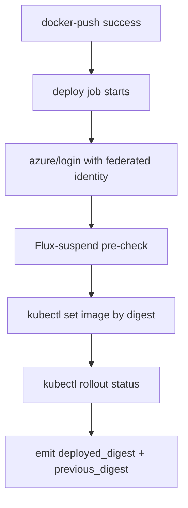

# Deploy Workflow Specification

This document specifies the deploy stage in `validate.yml` that updates the service deployment in AKS after a trusted image push.

## Overview

The deploy stage applies the newly built image digest to the service deployment, verifies rollout health, and emits deployment outputs consumed by integration testing.

## Architecture Integration

**References**:
- [CI/CD Build, Deploy, Test Design](cicd-build-deploy-test-design.md#52-deploy)
- [CI/CD Build, Deploy, Test Design: Workflow trust boundaries](cicd-build-deploy-test-design.md#55-workflow-trust-boundaries)
- [ADR-032: CI/CD Deploy Loop via Suspended Flux](../src/adr/032-cicd-deploy-loop-via-suspended-flux.md)
- [ADR-034: Federated Identity for Actions to Azure](../src/adr/034-federated-identity-actions-to-azure.md)
- [ADR-036: Workflow Trust Boundaries for CI/CD](../src/adr/036-workflow-trust-boundaries.md)

**Key Benefits**:
- **Deterministic Deploys**: Digest-based deployment avoids tag drift
- **Fast Failure Signals**: Flux-suspend pre-check fails before unsafe rollout
- **Downstream Traceability**: Exposes `deployed_digest` and `previous_digest` outputs

## Workflow Configuration

### Triggers
```yaml
# validate.yml job chain
check-initialization -> check-repo-state -> java-build -> docker-push -> deploy
```

**Execution Rule**: Deploy runs only after successful `docker-push` in trusted contexts.

### Inputs
```yaml
inputs:
  azure_client_id: required
  azure_tenant_id: required
  azure_subscription_id: required
  aks_resource_group: required
  aks_cluster_name: required
  namespace: required
  deployment_name: required
  container_name: required
  image_repository: required
  image_digest: required
  rollout_timeout: default '5m'
```

### Outputs
```yaml
outputs:
  rollout_status: 'success' | 'timeout' | 'failed'
  previous_digest: <sha256>
  deployed_digest: <sha256>
  pod_logs_url: <artifact-url>
```

### Trust Boundary Handling

Deploy uses the trust-boundary `if:` gate from design §5.5 and [ADR-036](../src/adr/036-workflow-trust-boundaries.md):

```yaml
if: |
  (
    needs.java-build.outputs.build_result == 'success' &&
    github.actor != 'dependabot[bot]' &&
    github.event_name != 'pull_request_target' &&
    (github.event_name != 'pull_request' ||
     github.event.pull_request.head.repo.full_name == github.repository)
  ) || (
    github.event_name == 'workflow_dispatch' &&
    inputs.force_full_pipeline == true
  )
```

This gate ensures cluster credentials are only used for trusted events while preserving the explicit manual `workflow_dispatch` escape hatch.

## Workflow Architecture

### High-Level Flow


### Dependencies
- Upstream workflow stage: `docker-push` in `validate.yml`
- Composite action: `.github/actions/aks-deploy/action.yml`
- Azure OIDC federation and AKS RBAC per [ADR-034](../src/adr/034-federated-identity-actions-to-azure.md)
- Suspended-Flux CI invariant per [ADR-032](../src/adr/032-cicd-deploy-loop-via-suspended-flux.md)

## Failure Modes

- Trust-boundary gate evaluates false → stage intentionally skipped
- Azure login fails → federated credential subject/permissions mismatch
- AKS credential retrieval fails → missing role bindings
- Flux not suspended → pre-check failure before rollout
- Rollout timeout/failure → job fails; pod logs are uploaded for triage

## References

- [CI/CD Build, Deploy, Test Design §5.2](cicd-build-deploy-test-design.md#52-deploy)
- [CI/CD Build, Deploy, Test Design §5.5](cicd-build-deploy-test-design.md#55-workflow-trust-boundaries)
- [ADR-032: CI/CD Deploy Loop via Suspended Flux](../src/adr/032-cicd-deploy-loop-via-suspended-flux.md)
- [ADR-034: Federated Identity for Actions to Azure](../src/adr/034-federated-identity-actions-to-azure.md)
- [ADR-036: Workflow Trust Boundaries for CI/CD](../src/adr/036-workflow-trust-boundaries.md)
