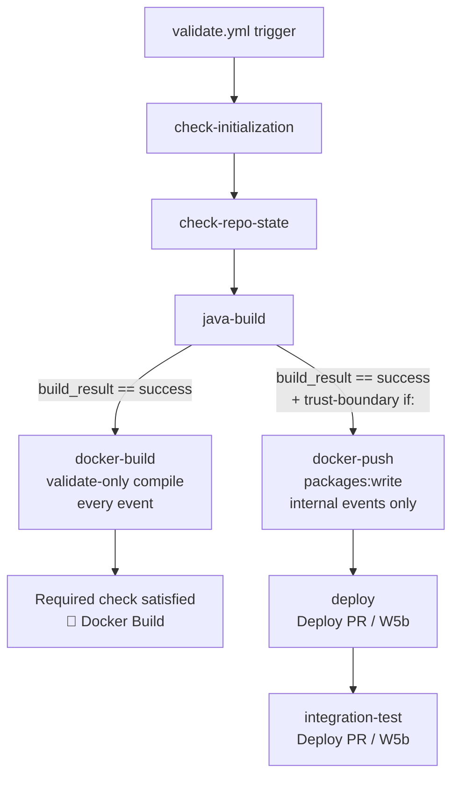
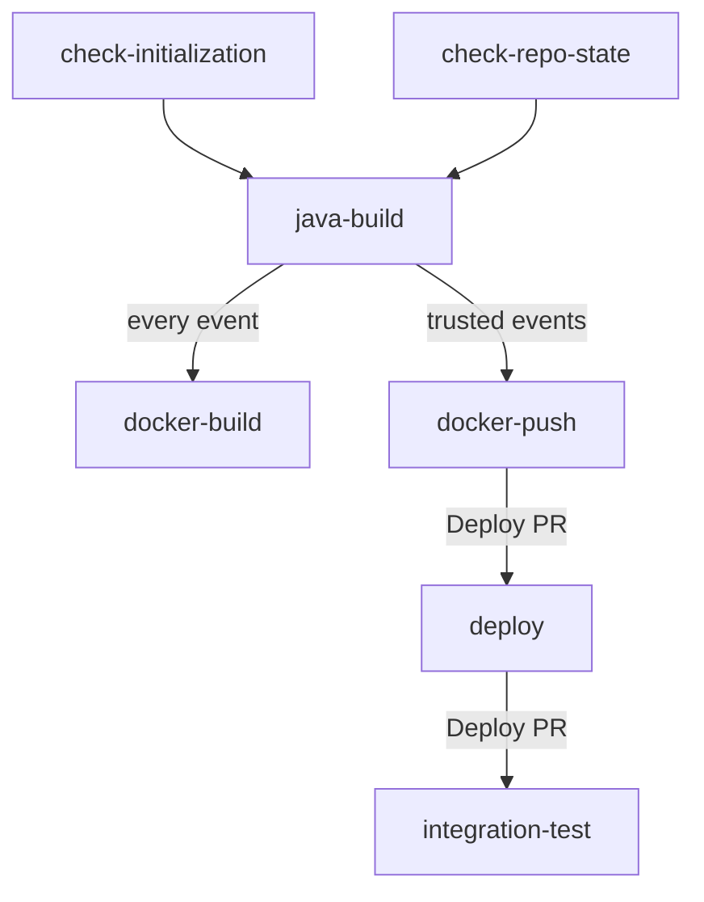

# Docker Build Workflow Specification

This document specifies the docker build stage (`docker-build` job in `validate.yml`) that provides container image validation for every workflow event and trusted image publication for internal pushes and pull requests.

## Overview

The docker-build job runs inside `validate.yml` after the `java-build` job succeeds. In the Build PR window it performs a validate-only Dockerfile compile on every event type — including external-fork pull requests — with no registry push and no cluster credential in play. A companion `docker-push` job, which carries `packages: write` and the §5.5 trust-boundary `if:` clause, handles the actual GHCR push for trusted events; the deploy and integration-test jobs that consume the pushed image are introduced in the Deploy PR (W5b).

**Parent design doc:** [OSDU SPI CI/CD: Build, Deploy, Integration Test](./cicd-build-deploy-test-design.md) — see §5.1 (Docker Build component design) and §9.5.A (Build PR scope).

## Architecture Integration

**References**:
- [ADR-033: GHCR as Service Image Registry](../src/adr/033-ghcr-as-service-image-registry.md)
- [ADR-035: Azure-Only Maven Profile](../src/adr/035-azure-only-maven-profile.md)
- [ADR-036: Workflow Trust Boundaries](../src/adr/036-workflow-trust-boundaries.md) *(ADR authored in wave 1; `if:`-clause enforcement lands in W5b/Deploy PR)*

**Key Benefits**:
- **Universal Dockerfile Validation**: Compile check runs on every event, including external-fork PRs, so contributors get early feedback before any merge
- **Immutable Image References**: Images are addressed by digest (`sha256:…`), never by mutable tag, so downstream deploy steps pin exactly what was tested
- **Privilege Separation**: The validate-only build carries only `contents: read`; `packages: write` is isolated to the companion `docker-push` job that is gated by the trust-boundary clause

## Workflow Configuration

### Job placement

`docker-build` is a job inside `template-workflows/validate.yml` only. It is **not** added to `build.yml` (per design decision D12: deploy stages are confined to `validate.yml` so that the trusted-event gating model is not accidentally bypassed by the feature-branch build path).

### Triggers

`docker-build` inherits the trigger surface of `validate.yml`:

```yaml
on:
  push:
    branches: [main, fork_integration, fork_upstream]
  pull_request:
    branches: [main, fork_integration, fork_upstream]
  workflow_dispatch:
    inputs:
      force_full_pipeline:
        description: 'Force full pipeline run (bypass paths-ignore)'
        type: boolean
        default: false
```

The `docker-build` job itself adds **no additional `if:` guard** beyond `needs.java-build.outputs.build_result == 'success'`. It runs on every qualifying event — including external-fork pull requests — because it performs a validate-only build with no secrets and no registry push.

### Permissions

```yaml
permissions:
  contents: read    # no packages:write — validate-only, runs on untrusted Dockerfile content
```

### Job block (excerpt from `validate.yml`)

```yaml
  docker-build:
    name: "🐳 Docker Build"
    needs: [check-initialization, check-repo-state, java-build]
    if: needs.java-build.outputs.build_result == 'success'
    runs-on: ubuntu-latest
    permissions:
      contents: read    # no packages:write
    steps:
      - uses: actions/checkout@v5
      - uses: actions/download-artifact@v5
        with:
          name: build-artifacts
          path: .
      - uses: ./.github/actions/docker-build
        with:
          push: 'false'
          dockerfile_path: devops/azure/Dockerfile
          image_name: ${{ vars.SERVICE_NAME }}
          registry: ghcr.io
          org: ${{ github.repository_owner }}
```

> **Note:** action references in this excerpt are shown by tag for readability. In the real `validate.yml`, pin every third-party action to a full commit SHA with a `# vX.Y.Z` comment (repo convention), and confirm the pinned major versions exist (`actions/download-artifact` current major is v4, not v5).

## Composite Action Contract

The job delegates to `.github/actions/docker-build/action.yml`.

### Inputs

| Input | Required | Default | Description |
|-------|----------|---------|-------------|
| `dockerfile_path` | No | `devops/azure/Dockerfile` | Path to the Dockerfile relative to the repo root |
| `build_context` | No | `.` | Docker build context directory |
| `image_name` | **Yes** | — | Short service name (e.g. `partition`); set from `vars.SERVICE_NAME` |
| `registry` | No | `ghcr.io` | Container registry host |
| `org` | No | `${{ github.repository_owner }}` | Registry organisation/owner |
| `jar_artifact_name` | No | `build-artifacts` | Name of the GitHub Actions artifact that contains the built JARs |
| `build_args` | No | — | Optional `--build-arg` values (newline-separated `KEY=VALUE`) |
| `push` | No | `false` | Set to `true` in the companion `docker-push` job only |

### Outputs

| Output | Description |
|--------|-------------|
| `image_repository` | Full registry path, e.g. `ghcr.io/<org>/<service>` |
| `image_digest` | SHA-256 digest of the pushed image, e.g. `sha256:abc123…` (already includes the `sha256:` prefix — do not prepend it again) |
| `image_tags` | Comma-separated tags pushed; for human/log use only — deploy stages must use `image_digest`, not a tag |

> **Digest format note.** `docker/build-push-action@v6` emits `outputs.digest` with the `sha256:` prefix already included. The deploy reference is composed as `${image_repository}@${image_digest}` — **do not** prepend `sha256:` again, or the reference becomes `@sha256:sha256:…`, which `kubectl set image` will accept but the kubelet will fail to pull.

In the `docker-build` (validate-only) job `push: 'false'` is set, so the action builds the image locally and emits no `image_digest` or `image_repository` outputs. The companion `docker-push` job is the digest source for downstream deploy steps.

## Tagging Strategy

When `push: 'true'` (companion `docker-push` job):

| Tag pattern | When applied |
|-------------|-------------|
| `:sha-<short-sha>` | Every push; immutable human-browseable identifier |
| `:<branch>-snapshot` | Push to a protected branch (`main`, `fork_integration`, `fork_upstream`); matches Maven `-Drevision=${branch}-SNAPSHOT` |
| `:<version>` (e.g. `:v1.2.3`) | Tag push created by Release Please |

Tags are documentation artefacts. Deployment always uses the digest reference.

## Workflow Architecture

### High-Level Flow



### Job Dependencies



## Failure Modes

| Failure | Symptom | Resolution |
|---------|---------|------------|
| `devops/azure/Dockerfile` missing | Job fails with message pointing at expected path | Add Dockerfile at `devops/azure/Dockerfile`; see POC notes for reference |
| JAR artifact missing (java-build skipped or failed) | `docker-build` job is skipped via `needs: java-build` dependency | Fix the java-build failure; docker-build re-runs automatically |
| GHCR push fails — rate limit or transient network | `docker-push` job fails | Re-run the failed job; GHCR push is idempotent |
| Image too large (>1 GB) | Warning surfaced in job summary | Not blocking in initial rollout; investigate multi-stage Dockerfile optimisation |
| First-time push — package created private | `docker-push` succeeds; downstream deploy fails with `ErrImagePull` | The action attempts an immediate public-visibility flip after push; `init.yml` reconciles visibility for fresh forks; `settings-apply.yml` reconciles for existing forks on schedule |
| `vars.SERVICE_NAME` not set | `image_name` input is empty; action fails | Run `init.yml` (fresh fork) or the ONBOARD-INIT-A helper (`setup-service-variables.sh`) to populate the variable |

## Trust Boundary (deferred to Deploy PR)

> **Build PR window:** `docker-build` is unrestricted — it runs on every event type with `permissions: contents: read` only. There is no cluster credential, no `packages: write`, and no Azure login. The attack surface from running an untrusted Dockerfile is a wasted compute minute, not a credential leak.

The §5.5 trust-boundary `if:` clause (ADR-036) applies to the **`docker-push`** job and, in the Deploy PR, to the downstream `deploy` and `integration-test` jobs. That clause is introduced in W5b (Deploy PR) because it protects the cluster federated identity, which does not exist until the Deploy PR lands.

**Compact trust-boundary clause (for reference — lives on `docker-push`, not `docker-build`):**

```yaml
if: |
  (
    needs.java-build.outputs.build_result == 'success' &&
    github.actor != 'dependabot[bot]' &&
    github.event_name != 'pull_request_target' &&
    (github.event_name != 'pull_request' ||
     github.event.pull_request.head.repo.full_name == github.repository)
  ) || (
    github.event_name == 'workflow_dispatch' &&
    inputs.force_full_pipeline == true
  )
```

See the [parent design doc §5.5](./cicd-build-deploy-test-design.md#55-workflow-trust-boundaries) and [ADR-036](../src/adr/036-workflow-trust-boundaries.md) for the full trust-boundary model and the rationale for each event-type decision.

## Integration with Other Workflows

### validate.yml

`docker-build` is a required check (`🐳 Docker Build` in the branch ruleset — W10 first pass). Because the job runs on every event including external-fork PRs, external contributors can satisfy the required check without holding a trusted identity.

### release.yml

The companion `docker-push` job pushes a `:<version>` tag when a Release Please tag is pushed (e.g. `:v1.2.3`). The `release.yml` workflow re-tags the existing image with the semver at release time (W7); it does not re-deploy.

### ghcr-retention.yml

A scheduled `ghcr-retention.yml` workflow (W11) prunes old `:sha-*` and `:<branch>-snapshot` tags from GHCR to control package storage growth. The `docker-build` action emits `image_tags` to make pruning logic straightforward.

### Deploy + integration-test (Deploy PR)

`docker-push` emits `image_repository` and `image_digest` outputs consumed by the `deploy` job introduced in W5b. The deploy reference is always `${image_repository}@${image_digest}` — never a tag. See the [parent design doc §5.2](./cicd-build-deploy-test-design.md#52-deploy) for the deploy job contract.

## Configuration

### Repository Variables

| Variable | Scope | Description |
|----------|-------|-------------|
| `SERVICE_NAME` | Per-fork repo variable | Short service name used as the GHCR image name (e.g. `partition`) |
| `MAVEN_PROFILE` | Per-fork repo variable | Maven profile passed to `java-build`; default `azure` (W1 / ADR-035) |

Both variables are bootstrapped during fork initialisation by the `ONBOARD-INIT-A` helpers (`setup-service-variables.sh`).

### Dockerfile Location

The action defaults to `devops/azure/Dockerfile`. Service forks follow the convention established in the `partition` reference fork. Override via the `dockerfile_path` input if the fork deviates.

## References

- [Parent design doc: OSDU SPI CI/CD Build, Deploy, Integration Test](./cicd-build-deploy-test-design.md) — §5.1 (Docker Build), §9.5.A (Build PR scope)
- [ADR-033: GHCR as Service Image Registry](../src/adr/033-ghcr-as-service-image-registry.md)
- [ADR-035: Azure-Only Maven Profile](../src/adr/035-azure-only-maven-profile.md)
- [ADR-036: Workflow Trust Boundaries](../src/adr/036-workflow-trust-boundaries.md) *(ADR authored in wave 1; `if:`-clause enforcement lands in W5b/Deploy PR)*
- [Build Workflow Specification](./build-workflow-spec.md)
- [Validate Workflow Specification](./validate-workflow-spec.md)
- [Release Workflow Specification](./release-workflow-spec.md)
