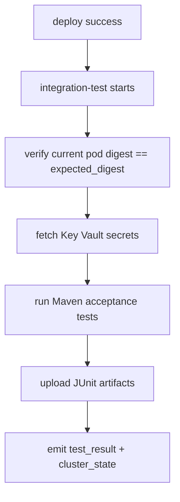

# Integration Test Workflow Specification

This document specifies the integration-test stage in `validate.yml` that runs acceptance tests against the deployment produced by the deploy stage.

## Overview

The integration-test stage validates runtime behavior after deployment, verifies the running image digest still matches the deployed digest, and reports required-check results to PR workflows.

## Architecture Integration

**References**:
- [CI/CD Build, Deploy, Test Design](cicd-build-deploy-test-design.md#53-integration-test)
- [CI/CD Build, Deploy, Test Design: Workflow trust boundaries](cicd-build-deploy-test-design.md#55-workflow-trust-boundaries)
- [ADR-032: CI/CD Deploy Loop via Suspended Flux](../src/adr/032-cicd-deploy-loop-via-suspended-flux.md)
- [ADR-036: Workflow Trust Boundaries for CI/CD](../src/adr/036-workflow-trust-boundaries.md)

**Key Benefits**:
- **Required-Check Signal**: Integration failures block merge
- **Digest Integrity Guard**: Detects mid-test image reversion
- **Operational Context**: Emits `cluster_state` and test report outputs

## Workflow Configuration

### validate.yml job chain
```yaml
check-initialization -> check-repo-state -> java-build -> docker-push -> deploy -> integration-test
```

**Execution Rule**: Integration tests run only after successful deploy in trusted contexts.

### Inputs
```yaml
inputs:
  test_dir: required
  namespace: required
  deployment_name: required
  container_name: required
  gateway_url: required
  keyvault_name: required
  secret_map: required
  dependencies: optional
  maven_goal: default 'verify'
  maven_profile: optional
  expected_digest: required
```

### Outputs
```yaml
outputs:
  test_result: 'pass' | 'fail' | 'pass-advisory'
  test_report_url: <artifact-url>
  cluster_state: 'healthy' | 'contaminated'
```

### Exit-Code Semantics (required-check compatible)

The job always exits with a binary success/failure code so branch-protection enforcement is unambiguous. Cross-service cluster contamination is surfaced as metadata (a PR label + step summary), never as a relaxation of the gate:

| Test outcome | Cluster state | Job exit | `test_result` | PR label |
|---|---|---|---|---|
| Pass | Healthy | success | `pass` | (none) |
| Pass | Contaminated (a dependency was unhealthy at probe time) | **success** | `pass-advisory` | `ci/cluster-was-contaminated` |
| Fail | Healthy | failure | `fail` | (none) |
| Fail | Contaminated | failure | `fail` | `ci/cluster-was-contaminated` |

`pass-advisory` means the tests passed **and** the start-of-run cross-service health probe found a dependency unhealthy — reviewers see the `ci/cluster-was-contaminated` label and know the pass may not be fully authoritative. It is metadata only; it never relaxes the required check. Merging despite real contamination-induced failures is an admin-override break-glass action, not a per-PR toggle.

### Trust Boundary Handling

Integration-test uses the same trust-boundary `if:` gate as deploy per design §5.5 and [ADR-036](../src/adr/036-workflow-trust-boundaries.md):

```yaml
if: |
  (
    needs.java-build.outputs.build_result == 'success' &&
    github.actor != 'dependabot[bot]' &&
    github.event_name != 'pull_request_target' &&
    (github.event_name != 'pull_request' ||
     github.event.pull_request.head.repo.full_name == github.repository)
  ) || (
    github.event_name == 'workflow_dispatch' &&
    inputs.force_full_pipeline == true
  )
```

The internal-PR check is intentionally guarded by `github.event_name != 'pull_request' || ...`, so `github.event.pull_request.*` is only evaluated for pull request events.

This keeps deploy and integration-test on a single trusted execution boundary.

## Workflow Architecture

### High-Level Flow


### Dependencies
- Upstream workflow stage: `deploy` in `validate.yml`
- Composite action: `.github/actions/integration-test/action.yml`
- Deploy-stage digest output from `.github/actions/aks-deploy/action.yml`
- Suspended-Flux deploy-loop model per [ADR-032](../src/adr/032-cicd-deploy-loop-via-suspended-flux.md)

## Failure Modes

- Trust-boundary gate evaluates false → stage intentionally skipped
- Digest mismatch during verification → fail (possible Flux resume/revert)
- Key Vault access denied → fail due to missing identity role
- Acceptance tests fail → fail and upload JUnit results
- Dependency-health contamination detected → recorded in `cluster_state`; does not override required-check semantics

## References

- [CI/CD Build, Deploy, Test Design §5.3](cicd-build-deploy-test-design.md#53-integration-test)
- [CI/CD Build, Deploy, Test Design §5.5](cicd-build-deploy-test-design.md#55-workflow-trust-boundaries)
- [ADR-032: CI/CD Deploy Loop via Suspended Flux](../src/adr/032-cicd-deploy-loop-via-suspended-flux.md)
- [ADR-036: Workflow Trust Boundaries for CI/CD](../src/adr/036-workflow-trust-boundaries.md)
